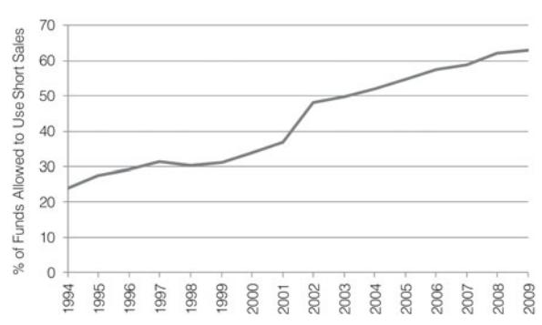
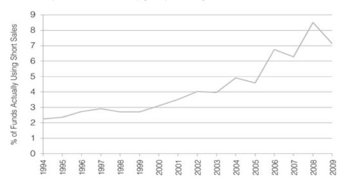

JOURNAL OF FINANCIAL AND QUANTITATIVE ANALYSIS Vol. 48, No. 3, June 2013, pp. 761–787 COPYRIGHT 2013, MICHAEL G. FOSTER SCHOOL OF BUSINESS, UNIVERSITY OF WASHINGTON, SEATTLE, WA 98195 doi:10.1017/S0022109013000264

# A First Look at Mutual Funds That Use Short Sales

Honghui Chen, Hemang Desai, and Srinivasan Krishnamurthy∗

# Abstract

We provide a first look at short selling by mutual funds, a phenomenon not examined by prior research. Mutual funds that short do so frequently and in significant amounts, averaging about 16% of fund assets. These funds outperform benchmarks by 1.5% per year. An analysis of portfolio holdings shows that these funds generate abnormal performance from their short (4.1% per year) and long (1.5% per year) positions. Managers of shortselling mutual funds also exhibit superior performance in other funds they manage that do not use short sales. These findings suggest that managers of short-selling mutual funds are skilled.

# I. Introduction

The past 3 decades have seen an impressive growth in the size and importance of the mutual fund industry. The total net assets of equity funds in the United States increased by 4,500% from \$79.7 billion in 1984 to \$3.7 trillion in 2008 (Investment Company Institute Fact Book, 2009). The increasing importance of mutual funds has been accompanied by a large body of academic research examining various facets of mutual fund performance. However, prior studies mainly focus on the long side of a mutual fund's portfolio. A lesser-known fact is that

∗Chen, honghui.chen@bus.ucf.edu, College of Business Administration, University of Central Florida, PO Box 161400, Orlando, FL 32816; Desai, hdesai@smu.edu, Cox School of Business, Southern Methodist University, PO Box 750333, Dallas, TX 75275; and Krishnamurthy, srini krishnamurthy@ncsu.edu, Poole College of Management, North Carolina State University, Campus Box 7229, Raleigh, NC 27695. We thank Nick Barberis, Nicole Boyson (the referee), Stephen Brown (the editor), Kalok Chan, N. K. Chidambaran, Erik Devos, Edwin Elton, Murali Jagannathan, Charles Knoeber, Karthik Raman, Kristian Rydqvist, Husayn Shahrur, Clemens Sialm, Yangru Wu, Lu Zheng, and seminar participants at Bentley College, Hofstra University, North Carolina State University, Ohio University, Rutgers University, University of Central Florida, University of South Florida, SUNY–Binghamton University, University of Texas at El Paso, the 2008 Western Finance Association Meetings, the 2007 Financial Management Association Meetings, the 2007 China International Conference in Finance, and the 2007 Shanghai International Conference on Behavioral Finance and Chinese Financial Markets for helpful comments. We thank John Banko for help with data collection and Nick McMann, Venkata Mudunuru, Nathan Rich, and Denise Shang for research assistance. This research was partially supported by a research grant from the College of Business Administration at the University of Central Florida (Chen) and the Poole College of Management at North Carolina State University (Krishnamurthy). We retain responsibility for any remaining errors.

in recent years, mutual funds have increasingly used short sales as an important component of their investment strategy. In spite of the increasing use of short sales by mutual funds, research on their characteristics and performance is sparse. Our paper fills this gap in the literature by providing the first detailed examination of the characteristics and performance of mutual funds that use short sales as part of their investment strategy.

Mutual funds have typically constrained fund managers from engaging in short sales. However, in recent years, funds are increasingly permitting their managers to engage in alternative investment strategies, including short sales.1 The proportion of domestic equity mutual funds that allow short selling has increased considerably from 24% in 1994 to 63% in 2009. The proportion of mutual funds that actually use short sales in a given year has also increased from 2% in 1994 to 7% in 2009. A change in the regulatory environment as well as changes in the competitive landscape in the industry may have contributed to the funds allowing their managers to engage in short selling. For example, prior to 1997, to be considered "pass-through" entities, mutual funds were subject to the "short-short" rule that limited gains from short-term positions (including short sales) to less than 30% of income. The Taxpayer Relief Act of 1997 repealed this rule and made it easier for mutual funds to use short sales. Additionally, in the face of increasing competition from other investment alternatives such as low-cost exchange traded funds and hedge funds, mutual funds may have desired to use other investment techniques (e.g., short selling) to boost returns. Further impetus was likely provided by retail investors who demanded access to hedge fund type strategies that were not available to them.2

Given the increasing use of short sales by mutual funds and the paucity of prior studies examining short selling by mutual funds, we undertake a detailed examination of the characteristics and performance of mutual funds that engage in short selling. Prior research has shown that short sellers, on average, are informed traders.3 Extending this line of argument to mutual funds would suggest that mutual fund managers engaging in short selling are skilled, and that the use of short sales by a mutual fund may be an ex ante indicator of managerial skill. On the other hand, mutual funds may use short selling mainly to hedge risks, or to increase the fund's leverage and hence its raw return. In such instances, absent skill, there should be no impact on the fund's risk-adjusted performance. Thus, we examine whether mutual funds that use short sales are able to earn significant abnormal returns on their overall portfolios. Moreover, if the managers engaging in short selling are skilled, then this skill should presumably be reflected in the

1&quot;Funds That Tame Bull and Bear," *BusinessWeek* (Jan. 26, 1998), p. 98. See also "Mutual Funds Adopt Hedge Fund Tactics," *The Wall Street Journal* (Feb. 21, 2006).

2In 2008, Fidelity launched a 130/30 large cap fund that would use short sales to meet demand from retail investors who wanted exposure to strategies that are usually available only to institutional investors ("Fidelity Fund Lets You Bet on Stocks' Fall," *The Boston Globe* (Apr. 8, 2008)).

3The model in Diamond and Verrecchia (1987) suggests that the costs of short selling may disproportionately drive out the less informed traders, leaving the relatively more informed traders, who will sell short. Empirically, Dechow, Hutton, Meulbroek, and Sloan (2001), Desai, Ramesh, Thiagarajan, and Balachandran (2002), and Diether, Lee, and Werner (2009), among others, find support for this prediction.

performance of both the short and long positions. Therefore, we examine the performance of the long and short portfolios separately. Finally, as an additional test of fund-manager skill, we track the managers of short-selling funds and examine the performance of *other funds* managed by them where no short sales are used, to test if they exhibit superior performance in those funds.

Our analysis is based on a comprehensive sample of 323 mutual funds that are available on the Center for Research in Security Prices (CRSP) mutual fund database and that reported using short sales on form N-SAR filed with the Securities and Exchange Commission (SEC) during the period 1994–2006. The mean (median) total net assets of the sample funds is \$678 million (\$83 million), indicating that both large and small mutual funds engage in short selling. Mutual funds engaging in short sales are younger, and they have larger expense ratios, greater portfolio turnover, and higher management fees relative to their sizematched (total net assets) control funds. These funds are as likely to be team managed as run by individual managers. We find that about 30% of the sample funds follow an aggressive growth strategy, and about 40% of the funds follow a long-term growth or a growth/income strategy. The mutual funds that use short sales do so frequently. More than 60% of our sample funds reported using short sales in at least 3 of the semiannual N-SAR reports filed in the 3 years after they first reported using short sales. The magnitude of the aggregate short positions is also sizable, averaging \$34.7 million or 15.6% of fund assets. The shorted stocks are larger and have a higher share turnover than stocks in the long portfolio, likely because it is easier to locate institutional lenders for such stocks. The shorted stocks also tend to be glamour stocks with high total accruals and high prior sales growth, suggesting that the information set of mutual fund managers is correlated with the information in valuation and earnings quality indicators. This result is consistent with prior research that documents that glamour stocks and high accrual stocks underperform (Lakonishok, Shleifer, and Vishny (1994), Sloan (1996)).

The results of the performance analyses show that mutual funds that use short sales exhibit significant abnormal returns. The average annualized alpha, using gross returns and the Fama-French-Carhart 4-factor time-series model (hereafter, the FF-Carhart model) is a statistically significant 1.6% per year. When the alpha of the sample funds is benchmarked against the alpha of other funds matched on size, the control fund-adjusted abnormal return is a significant 1.5% per year. Using net returns, the control fund-adjusted abnormal return is 1.2% per year. We verify that this result also obtains in the cross section, as the coefficient on the dummy variable indicating the use of short sales is positive and significant after controlling for other variables that may be related to returns. The shortselling dummy variable continues to be positively associated with performance even when we take into account the use of alternative investment strategies by the fund such as leverage, derivatives, and investments in restricted securities, suggesting that managers engaging in short selling are skilled, and that their superior performance cannot be fully explained by the use of these other investment strategies. The abnormal returns are similar when we benchmark the alpha of the sample funds against the alpha of other funds matched both on fund size and investment style (identified using an approach similar to that in Brown and Goetzmann (1997)). The results are robust to the use of alternative factor models to estimate the alpha. Furthermore, using the portfolio holdings data from 2003 to 2006 as reported in the CRSP survivorship-free mutual fund database, the alpha of the short portfolio is 4.1% per year (*p*-value < 0.10). The corresponding alpha of the long portfolio is 1.5% (*p*-value < 0.05). We find similar results using the long portfolio holdings from the Thomson Financial database over the entire sample period (1994–2006).4 The characteristic selectivity (CS) measure (calculated as in Daniel, Grinblatt, Titman, and Wermers (1997)) is also significantly positive (1.7% per year). Finally, the control fund-adjusted performance of *other funds managed by the sample fund managers where no short sales are used* is also significant and ranges from 1.0% to 1.9% per year. Collectively, the results support the hypothesis that fund managers who use short sales are skilled, and they suggest that the use of short sales by a mutual fund may be an ex ante indicator of fund-manager skill.

Our investigation contributes in several ways to the mutual fund literature. The extant research on mutual funds has not examined short selling by mutual funds. Our analysis provides a comprehensive first look at mutual funds that use short sales.5 We find that the proportion of mutual funds that permit the use of short sales has steadily increased over time, and a majority of equity mutual funds in 2009 permit short selling. We find a similar increase in the proportion of funds that actually use short sales. An examination of the performance of the funds shows that mutual funds that use short sales exhibit superior performance, suggesting that they are managed by skilled managers. A back of the envelope calculation suggests that a mutual fund that engaged in short selling increased investor wealth by an average of \$8 million per year (estimated as a mean control fund-adjusted abnormal return of 1.176% per year × average net assets of \$678 million).

Our study also contributes to the broader debate on whether mutual fund managers are skilled.6 In a seminal article, Jensen (1968) shows that actively managed mutual funds fail to beat passive benchmarks. The issue of whether fund managers have stock-picking skill has continued to be a topic of considerable debate ever since. The ongoing debate is exemplified by two recent papers.

4The mutual fund holdings database from Thomson Financial does not have short portfolio holdings.

5Almazan, Brown, Carlson, and Chapman (2004) study the use of investment restrictions by mutual funds, but they do not examine whether a fund that is *allowed to* use short sales would *actually use* short sales and whether the use of short sales is related to fund performance. Koski and Pontiff (1999), Deli and Varma (2002), and Cici and Palacios (2010) examine mutual funds that either use or are allowed to use derivatives, but they do not examine the use of short selling by mutual funds. Others such as Brunnermeier and Nagel (2004) and Griffin and Xu (2009) investigate the performance of hedge funds. Closer to this study, Agarwal, Boyson, and Naik (2009) find that hedged (long-short) mutual funds are able to earn a significant alpha. We note that the funds using short selling in our sample follow a wide range of investment objectives, including (but not limited to) "hedged mutual funds" that are market neutral. We thank Nicole Boyson for sharing the sample from Agarwal et al. (2009).

6A partial list of studies that do not find evidence of skill includes Jensen (1968), Malkiel (1995), and Carhart (1997). In contrast, Grinblatt and Titman (1989), (1993), Chen, Jegadeesh, and Wermers (2000), Wermers (2000), and Baker, Litov, Wachter, and Wurgler (2010) find evidence in favor of fund-manager skill.

Fama and French (2010) find that few funds reliably outperform passive benchmarks, suggesting that fund-manager skill is elusive, whereas Kosowski, Timmermann, Wermers, and White (2006) conclude that a sizable minority of managers exhibit stock-picking skill. However, Alexander, Cici, and Gibson (2007) argue that a fund's long portfolio is the outcome of both voluntary trades that are information based and forced trades that are due to fund flows. Thus, an examination of long-only funds is likely to be a less powerful test of the stock-picking skill of mutual fund managers. Since short sales are more likely to be voluntary trades, superior performance of mutual funds that use short sales suggests that the use of short sales is likely a better ex ante measure of the stockpicking skill of fund managers.7

The rest of the paper is organized as follows: Section II presents an overview of the restrictions on the use of short selling by mutual funds and how they have been gradually eased in recent times. Section III describes the selection of sample and control funds. Section IV contains the main results, and Section V concludes the paper.

# II. Institutional Details8

Investors in general have been able to short sell stocks subject to restrictions such as the uptick rule, margin requirements, etc. (e.g., see Sec. 2.1 in Dechow et al. (2001)). However, open-end mutual funds have faced additional legal restrictions on their ability to take short positions, as stated in the Investment Company Act of 1940 (hereafter, the 1940 Act or the Act). Section 12(a)(3) of the Act states: "It shall be *unlawful for any registered investment company*, in contravention of such rules and regulations or orders as the Commission may prescribe as necessary or appropriate in the public interest or for the protection of investors, *to effect a short sale of any security*, except in connection with an underwriting in which such registered company is a participant *(italics added)*." At first glance, this appears to severely limit the ability of mutual funds to use short sales and has led to a widespread belief among both practitioners and academics that mutual funds virtually never use short sales.9

Since short selling by a fund is similar to using leverage, the SEC has chosen to regulate the use of short selling by mutual funds under Section 18 of the Act, which regulates the use of leverage or senior securities.10 Section 18(f)(1) states that an open-end fund can use leverage as long as it maintains asset coverage of at least 300% (i.e., the fund's net assets plus market value of securities sold

7Because many skilled managers may not use short sales, short selling may be a sufficient (but not necessary) indicator to infer fund-manager skill.

8We thank Stephen Brown for suggesting this discussion, and Kyle Ahlgren, Senior Counsel, Division of Investment Management, SEC, for helpful discussions.

9For example, Chen, Hong, and Stein (2002) state "that mutual funds rarely, if ever, take short positions. This *lack of shorting among mutual funds is crucial* if we are to use breadth as a proxy for negative information held off the market [italics added]." While we observe that few funds use short sales in our sample (less than 10% per year, on average), almost 60% of mutual funds were allowed to use short sales, suggesting that the lack of shorting is not due to an inability to use short sales.

10Footnote 64 in "Mutual Funds and Derivative Instruments," Division of Investment Management at the U.S. Securities and Exchange Commission (Sept. 26, 1994).

short is at least 300% of the latter). However, the SEC has progressively relaxed restrictions on short selling over time.11

SEC Release IC-10666 in 1979 clarifies that an investment company would be compliant if it held a sufficient amount in segregated accounts to cover the senior security. Holding liquid assets such as cash, U.S. government securities, or high-grade debt in segregated accounts whereby they cannot be traded or sold would counter the leverage effect and would ensure that the fund is able to meet its obligations arising from shorting activities.12 Thus, short selling by mutual funds faced the 300% asset coverage restriction unless they placed adequate liquid assets (e.g., cash or high-grade debt) in segregated accounts to undo or cleanse the effects of leveraging.

In 1995, the SEC relaxed the requirement that the amount in the segregated account, plus any collateral deposited with the broker due to a short sale (not including the proceeds from the short sale), should be greater than both the market value of the shorted securities at the time they were shorted and the current market value. Thus, a fund would be compliant under Section 18 if it held an amount sufficient to cover the current market value of the security sold short.13 In 1996, the SEC made it easier for equity mutual funds to establish segregated accounts by allowing liquid securities including equity securities to be held in such accounts, rather than restricting the assets to be comprised of cash, U.S. Treasuries, or highgrade debt.14 In 1997, the SEC further agreed to allow the funds to designate securities as segregated assets based solely on the fund records and not on the fund's custodian's records.15

The previous discussion makes it clear that over the years, regulatory restrictions on short selling have been steadily relaxed, making it easier for mutual funds to engage in short sales. This has resulted in an increase both in the number of funds that are allowed to use short sales and in the number of funds that actually use short sales, as discussed below.

# III. Sample

Under the Investment Company Act of 1940, all registered management investment companies are required to use form N-SAR to file their semiannual and

11More details are available on the SEC Web site at http://www.sec.gov/divisions/investment/ seniorsecurities-bibliography.htm.

12A fund would need to maintain an amount in the segregated account that, together with any collateral deposited with a broker as a result of the short sale (excluding the proceeds of the short sale), would be sufficient to cover the higher of the current market value and the market value of the securities sold short at the time they were shorted. Since equity funds usually did not hold high-grade debt securities, this limited their ability to use short sales.

13See the SEC's no-action letter response to Robertson Stephens Investment Trust (Aug. 24, 1995). Suppose that an equity fund shorted \$25 worth of stocks and deposited assets worth \$35 (the entire proceeds of the short sale plus collateral of \$10) with the broker. Suppose that the current market value of the shorted assets is \$15. For purposes of compliance under Section 18, the fund would be required to place cash or high-grade debt worth \$5 in segregated accounts (\$15 − \$10), whereas the segregated assets that would have been required prior to the relaxation of the rule would have been

\$15 (\$25 − \$10). 14See the SEC's no-action letter response to Merrill Lynch Asset Management (July 2, 1996).

15See the SEC's letter to fund CFOs (Nov. 7, 1997).

annual reports with the SEC. This form has over 125 questions that request information about portfolio transactions, investment practices, and financial information (condensed balance sheet and expense data) for each mutual fund portfolio covered in the form. One of the questions (#70R) specifically asks whether the investment policies of the mutual fund permit short selling and whether the fund engaged in short selling during the reporting period. The responses to these two questions form the basis for selecting the sample of mutual funds that use (or are permitted to use) short sales.

We electronically download all form N-SARs for the years 1994–2009 from the SEC's EDGAR database. The proportion of domestic equity funds that indicated on form N-SAR that they were allowed to use short sales increased from 24% in 1994 to 63% in 2009 (Figure 1). Importantly, the proportion of funds that actually used short sales increased from 2.2% in 1994 to 7.1% in 2009 (Figure 2). In each of the years from 2006 to 2009, more than 6% of the funds used short sales, indicating that short selling by mutual funds has increased in recent years. We then identify all actively managed domestic U.S. equity mutual funds from the CRSP survivorship-free mutual fund database and excluded bond, global and international equity, money market, and index funds. We manually link the funds identified from the N-SAR filings to the actively managed domestic equity funds in the CRSP mutual fund database.16 The sample period starts in 1994 because coverage on the EDGAR database is sparse before 1994. The sample period ends in 2006 because we require at least 24 months of returns in the 3 years after the N-SAR date to estimate the abnormal return. We find 2,066 mutual funds that permitted short selling. Of these, 323 unique mutual funds state that they used short sales during the reporting period (the *shorted* sample), and this sample is used in our empirical analyses. The statistics in Table 1 show that in every year in our sample period (1994–2006), over 100 unique funds were first allowed to

FIGURE 1 Mutual Funds Allowed to Use Short Sales (1994–2009)

16To ensure accurate matching, we excluded funds where the net assets reported on CRSP differ by more than 10% from the net assets reported on form N-SAR more than 25% of the time.

### FIGURE 2 Short Selling by Mutual Funds (1994–2009)

Figure 2 shows the proportion of domestic equity mutual funds that indicated on form N-SAR (downloaded from the SEC's EDGAR database) that they used short sales in any given year during 1994–2009.

TABLE 1 Incidence of Shorting Activity (1994–2006)

Columns (1) and (2) of Table 1 list the number of actively managed domestic equity funds in the CRSP mutual funds database during 1994–2006 and the assets managed by them. Columns (3) and (4) provide the same data, but for the subsample of CRSP funds for which we are able to find N-SAR reports on EDGAR. Column (5) reports the proportion of assets managed by funds with data on both CRSP and N-SAR, as a percentage of the aggregate assets of actively managed domestic equity funds listed in the CRSP mutual funds database. The last 2 columns report the total number of mutual funds that were first allowed to use short sales and that first used short sales in that year.

|                                                                                              | CRSP                                                                                                     |                                                                                                                                          | CRSP & N-SAR                                                                                        |                                                                                                                                        | Percent in N-SAR                                                                          | No. of Funds that                                                             |                                                                      |  |
|----------------------------------------------------------------------------------------------|----------------------------------------------------------------------------------------------------------|------------------------------------------------------------------------------------------------------------------------------------------|--------------------------------------------------------------------------------------------------------|----------------------------------------------------------------------------------------------------------------------------------------|----------------------------------------------------------------------------------------------|----------------------------------------------------------------------------------|----------------------------------------------------------------------|--|
|                                                                                              | No. of Funds                                                                                          | Total Assets (\$billion)                                                                                                              | No. of Funds                                                                                        | Total Assets (\$billion)                                                                                                            | %                                                                                            | Were First Allowed to Short                                                   | First Engaged in Short Sales                                      |  |
| Year                                                                                         | (1)                                                                                                      | (2)                                                                                                                                      | (3)                                                                                                    | (4)                                                                                                                                    | (5) = (4) / (2)                                                                              | (6)                                                                              | (7)                                                                  |  |
| 1994 1995 1996 1997 1998 1999 2000 2001 2002 2003 2004 2005 | 1,326 1,501 1,636 1,887 2,272 2,444 2,661 2,849 2,877 2,790 2,801 2,802 | 561.42 751.84 1,055.47 1,411.41 1,916.76 2,284.43 2,772.51 2,382.84 1,979.60 1,963.62 2,459.25 2,653.13 | 798 1,169 1,289 1,423 1,648 1,758 1,952 2,076 2,112 2,188 2,175 2,177 | 374.08 627.13 879.97 1,124.99 1,596.26 1,852.39 2,396.19 2,106.56 1,876.42 1,607.03 2,144.56 2,307.59 | 66.6 83.4 83.4 79.7 83.3 81.1 86.4 88.4 94.8 81.8 87.2 87.0 | 141 170 103 104 150 119 149 162 294 217 151 159 | 16 15 20 20 20 12 25 27 26 22 17 29 |  |
| 2006 Total                                                                                | 2,904                                                                                                    | 3,044.40                                                                                                                                 | 2,199                                                                                                  | 2,628.11                                                                                                                               | 86.3                                                                                         | 147 2,066                                                                     | 74 323                                                            |  |

use short sales. Similarly, the 323 funds in the shorted sample are not clustered in time, even though there is an increase in the year 2006.

The funds that are both in the N-SAR and the CRSP database account for 80% or more of the total assets of all actively managed domestic equity funds listed on CRSP in every year during 1995–2006. The only exception is 1994, when the overlap is 67%, likely because mutual funds were just beginning to file their reports electronically at that time. This suggests that we are able to identify a sizable portion of the population of mutual funds on the CRSP database. The number of CRSP funds for which we were able to obtain N-SAR data electronically from EDGAR during 1994–2000 closely matches the sample in Almazan et al. ((2004), Tab. 1). The proportion of funds that are allowed to use short sales (all funds, not just those that were allowed to short for the first time) also corresponds closely with the results documented in Almazan et al. and serves to validate our data collection.17

Some of our tests use control fund-adjusted performance, where the control funds are matched on net assets and are not allowed to use short sales as of the end of the N-SAR reporting period. The size matching is motivated by the prior literature that links fund size to performance (Berk and Green (2004), Chen, Hong, Huang, and Kubik (2004)). For each sample fund, we select 20 control funds that are closest in net assets to the sample fund and use the alpha of these 20 control funds as the benchmark to estimate abnormal return.18,19 Size matching works well, as the mean difference in net assets of the sample and control funds is only −0.17% of sample fund net assets and is within 30% of sample fund net assets in more than 97% of the instances.

# IV. Results

### A. Descriptive Characteristics

### 1. Fund Characteristics

The CRSP mutual fund database is the source of most of the mutual fund data used in the study, including fund objective, fees, loads, returns, and portfolio turnover.20 We find that the sample funds follow a wide variety of investment styles (results not tabulated). The majority of the funds (more than 70% of the sample) follow aggressive growth, long-term growth, or growth/income strategies.21 The value of average (median) total net assets for the sample funds, reported in Panel A of Table 2, is \$678 million (\$83 million). This suggests that our sample consists of both small and large funds. The sample funds are relatively young, with an average age of 6.8 years. The funds in the sample trade actively,

17In the years subsequent to the time period examined by Almazan et al. (2004), the proportion of mutual funds that are allowed to use short sales increases markedly to 40% in 2001 and to 60% in 2006. In untabulated tests, we find that the alpha of the mutual funds that are allowed to short is small (0.5% per year using gross returns and the FF-Carhart 4-factor model). Hence, even though the number of funds that are allowed to use short sales has increased significantly since the time period examined in Almazan et al., our performance results mirror theirs.

18The control fund-adjusted abnormal return approach also addresses concerns about "omission" bias in the CRSP data, which results from missing returns for small, poorly performing funds (Elton, Gruber, and Blake (2001)). Because both the sample and control funds are subject to the same potential bias, this concern is minimized. We use a large number of control funds so that we have a stable benchmark that is not overly influenced by any one fund.

19We also use alternative control funds matched on size and investment style (using an approach similar to that in Brown and Goetzmann (1997)) and provide more specific details of the matching process in Section IV.B.2.

20The net assets are aggregated across all fund classes, and fund age is based on the oldest fund class. Other fund characteristics are weighted averages across the different fund classes. We note that the CRSP mutual fund database does not have data for all variables over our sample period.

21For a subsample of funds that we are able to match with the Morningstar mutual fund database, we find that long-short funds account for only 10% of the sample. Funds in other categories such as large-cap, mid-cap, small-cap, etc., account for almost 90% of the funds.

with average turnover of 282% of the fund assets. The mean total load is 2.09%, and the 12b-1 fees attributed to marketing and distribution costs average 0.22% of total net assets. The overall operating expenses (including the 12b-1 fees) average 1.66%, and the mean management fee is 0.94% of total net assets. A comparison with net assets-matched control funds shows that the sample funds are younger by about 4 years. The sample funds have higher turnover (282% vs. 94%), higher expense ratio (1.66% vs. 1.40%), and higher management fees (0.94% vs. 0.78%) than control funds. The differences are not an artifact of smaller fund size, because the mean net assets of the sample funds are higher than those of the control funds.

TABLE 2 Summary Characteristics of Mutual Funds That Use Short Sales

Panel A of Table 2 reports the mean and median values of several characteristics for actively managed domestic equity funds that used short sales during 1994–2006. The fund characteristics are as of the first time the funds used short sales. We compare the sample fund characteristics with those of a contemporaneously net assets-matched group of 20 control funds. All fund characteristics are from the CRSP mutual fund database. Panel B describes the frequency and magnitude of shorting activity, as reported in the semiannual N-SAR reports filed by the sample funds in the 3 years after they first reported using short sales. The significance levels for differences in mean (median) in Panel A are computed using the t-test (Wilcoxon signed-rank test). \*\* and \* denote that the sample values are significantly different from the values for control funds at the 1% and 5% levels, respectively.

#### Panel A. Fund Characteristics

|                                      | Net Assets (\$mill)   | Age (years)        | Portfolio Turnover   | Expenses (%)         | Front-End Load (%) | Back-End Load (%)  | 12b-1 Fees (%)      | Mgmt. Fees (%)       |
|--------------------------------------|--------------------------|-----------------------|-------------------------|-------------------------|-----------------------|-----------------------|------------------------|-------------------------|
| Sample Funds Mean Median N  | 678.45 83.36 323   | 6.8** 3.6** 323 | 2.82** 1.14** 318 | 1.66** 1.59** 323 | 1.34 0.00 320   | 0.75 0.08* 323  | 0.22** 0.15* 323 | 0.94** 0.85** 226 |
| Control Funds Mean Median N | 489.75 83.98 6,460 | 10.9 6.7 6,460  | 0.94 0.61 6,369   | 1.40 1.30 6,438   | 1.35 0.00 6,435 | 0.65 0.00 6,429 | 0.19 0.05 6,460  | 0.78 0.75 4,497   |

#### Panel B. Shorting Activity

|        | Use of Short Sales |            | Magnitude of Short Sales |                 |  |
|--------|--------------------|------------|--------------------------|-----------------|--|
|        | No. of Times       | % of Times | \$Millions               | % of Net Assets |  |
| Mean   | 3.42               | 62.88      | 34.68                    | 15.65           |  |
| Median | 3.00               | 66.67      | 4.42                     | 3.93            |  |
| N      | 323                | 323        | 149                      | 149             |  |

#### 2. Shorting Activity

We find that mutual funds that use short sales do so frequently (Panel B of Table 2). We collect details about their shorting activity from the semiannual N-SARs filed over the 3 years subsequent to the first time they reported using short sales. We find a total of 1,800 reports filed by the 323 sample funds. Two hundred ninety-five funds filed 4 or more N-SAR reports during this 3-year period. Fiftyseven percent of the funds (183 funds) report using short sales in at least 3 of their N-SAR reports. On average (median), a fund reports using short sales in 63% (67%) of the N-SAR reports filed in this period. This indicates that the sample funds that use short sales do so on a regular basis. The amount of short selling reported as outstanding on form N-SAR is also substantial. The mean aggregate (percentage) short position per fund is \$34.7 million (15.6% of fund net assets), indicating that the use of short sales is a regular and significant component of their investment strategy.22 However, this statistic likely underestimates the prevalence of shorting activity, because funds may have initiated and covered their short positions within a reporting period.

### 3. Stock Characteristics

The evidence presented above suggests that the sample funds short sell frequently and in considerable amounts. A natural question is what are the characteristics of the stocks that are shorted, and are these characteristics different from the characteristics of stocks in the long portfolio? To address this question, we identify all actively managed domestic equity mutual funds that had outstanding short positions in domestic U.S. equities from the CRSP mutual fund database. Our choice of the CRSP database is based on the fact that it reports *both* long and short positions in the portfolio holdings, whereas the Thomson Financial mutual fund database only includes holdings from the long portfolio. The CRSP database includes portfolio holdings of individual mutual funds with effective dates starting in the 2nd quarter of 2003; the coverage prior to this date is sparse. We thus focus on portfolio holdings of mutual funds that had outstanding short positions in domestic U.S. stocks, with an effective date from Apr. 2003 to Dec. 2006.23 We focus on actively managed domestic equity mutual funds and eliminate bond, global and international equity, index, asset allocation, and money market funds. This yields a sample of 99 mutual funds that reported open short positions in domestic stocks over this time period. The data include the effective date of the portfolio holdings and the number of shares, company name, and CRSP identifier PERMNO for each stock held in the long and the short portfolio. We link the mutual fund portfolio holdings data to the CRSP stock database using the PERMNO as the link variable, and we collect stock returns and shares outstanding data from CRSP.24 We retain portfolio holdings of domestic stocks (CRSP share code 10 or 11), and exclude all other securities.

Every year (July*t* to June*t*+1), we identify all domestic common stocks that were shorted by the 99 funds during this period and calculate the various characteristics at the end of June*t*. We compare the characteristics of the shorted stocks to the characteristics of stocks in 2 comparison groups. The 1st comparison group includes stocks held in the long portfolio by the same mutual funds, and the 2nd group includes all CRSP-listed stocks, excluding the stocks in the mutual

22We calculate the time-series mean of the amount (or proportion of assets) shorted for each fund when it reported outstanding short positions on form N-SAR, and we then obtain the cross-sectional average or median of these values.

23The sample period ends in 2006 so that we have adequate data to estimate the performance in Section IV.C.1. It should also be noted that CRSP changed its vendor from Morningstar to Lipper in 2008. The portfolio holdings in more recent versions of the database are less complete (see, e.g., Huang and Wang (2013)). However, the portfolio holdings data used in our study come from earlier versions of CRSP when the data vendor was Morningstar. Thus, the CRSP portfolio holdings data used in our study do not suffer from this limitation.

24For all the shorted stocks in a randomly selected sample of 5 portfolio holdings from the CRSP mutual fund database, we check the data integrity by i) confirming that the list of shorted stocks reported on the CRSP database matches that reported on EDGAR, and ii) verifying that the PERMNO for these stocks in the mutual fund database matches that on the CRSP stock file. We thank Edwin Elton for suggesting that we undertake this verification.

funds' short portfolios. For ease of exposition, we term these 3 samples the shorted stocks, long stocks, and CRSP stocks, respectively. All the financial statementrelated data are from Compustat. We use the decile breakpoints from Ken French's Web site (http://mba.tuck.dartmouth.edu/pages/faculty/ken.french/data library .html) to assign size, book-to-market (BM) ratio, and momentum deciles to the stocks, and we thank Ken French for making the data publicly available.

The statistics in Table 3 show that stocks in the short portfolio are larger and more liquid than stocks in the long portfolio. The mean (median) market value of equity of shorted stocks is \$5,928 million (\$1,027 million), which is significantly higher than the mean (median) equity market value of \$4,660 million (\$798 million) for stocks in the long portfolio. Similarly, the mean annual turnover of the shorted stocks is larger than that for the long stocks (1.66 vs. 1.43). A similar pattern obtains when we use the other CRSP-listed stocks as the benchmark:

### TABLE 3 Characteristics of Stocks in the Short and Long Portfolios

For the sample of domestic equity funds that reported short positions in their portfolio holdings during 2003–2006, Table 3 reports the mean and median values of characteristics of stocks that are shorted, stocks held in long portfolios, and all CRSP-listed domestic stocks that are not shorted. The characteristics are as of Junet for all the positions held by any sample fund from Julyt through Junet+1. Every year, a stock is included only once regardless of how many funds hold a position. Size is the market value of equity, and turnover is the annual share turnover from Julyt−1 through Junet. Momentum is the raw buy-and-hold return over the previous 11 months ending in May. BM in year t is the ratio of book equity for the fiscal year ending in the calendar year t − 1 to the market value of equity at the end of year t − 1. Total accruals is calculated as (income before extraordinary items less cash flow from operating and investing activities), scaled by average total assets. Sales growth is the growth in net sales in the previous year. Industry-adjusted values are calculated by subtracting the median for all firms in the same 2-digit SIC code in the same year from the values for individual firms. The decile breakpoints are based on NYSE stocks and are downloaded from Ken French's Web site (http://mba.tuck.dartmouth.edu/pages/faculty/ken.french/data library.html). The last 2 columns report the t-values (z-values) for differences in mean (median) using t-tests (Wilcoxon signed-rank tests).

|                       | Shorted Stocks | Long Stocks | All CRSP, Excluding (1) | Test Statistics |           |  |
|-----------------------|----------------|-------------|----------------------------|-----------------|-----------|--|
| Variables             | (1)            | (2)         | (3)                        | (1) − (2)       | (1) − (3) |  |
| Panel A. Shortability |                |             |                            |                 |           |  |
| Size                  | 5,927.50       | 4,660.00    | 915.20                     | 4.38            | 25.02     |  |
|                       | 1,026.50       | 797.70      | 122.20                     | 12.19           | 73.70     |  |
| Size decile           | 4.69           | 4.20        | 2.00                       | 10.88           | 76.11     |  |
|                       | 4.00           | 4.00        | 1.00                       | 11.74           | 71.27     |  |
| Turnover              | 1.66           | 1.43        | 0.83                       | 10.20           | 38.23     |  |
|                       | 1.31           | 1.11        | 0.43                       | 14.99           | 61.30     |  |
| Panel B. Performance  |                |             |                            |                 |           |  |
| Momentum              | 0.17           | 0.22        | 0.19                       | −4.90           | −2.08     |  |
|                       | 0.06           | 0.11        | 0.11                       | −10.41          | −5.76     |  |
| Momentum decile       | 5.26           | 5.72        | 5.55                       | −9.77           | −5.96     |  |
|                       | 5.00           | 6.00        | 6.00                       | −9.68           | −5.56     |  |
| BM                    | 0.49           | 0.56        | 0.76                       | −8.49           | −22.40    |  |
|                       | 0.39           | 0.46        | 0.57                       | −11.50          | −28.37    |  |
| BM decile             | 4.11           | 4.71        | 5.67                       | −12.82          | −31.45    |  |
|                       | 3.00           | 4.00        | 6.00                       | −12.83          | −30.30    |  |
| Total accruals (%)    | 2.43           | 1.77        | 0.53                       | 2.55            | 6.92      |  |
|                       | 1.65           | 1.19        | 0.97                       | 3.34            | 6.39      |  |
| Total accruals        | 2.38           | 1.52        | −1.03                      | 3.43            | 12.70     |  |
| Industry adjusted (%) | 1.33           | 0.64        | −0.41                      | 4.58            | 14.11     |  |
| Sales growth (%)      | 17.44          | 15.36       | 16.33                      | 3.27            | 1.64      |  |
|                       | 10.41          | 9.78        | 9.35                       | 1.85            | 2.83      |  |
| Sales growth          | 9.36           | 6.84        | 5.12                       | 4.09            | 6.40      |  |
| Industry adjusted (%) | 2.19           | 0.95        | −0.76                      | 3.43            | 11.77     |  |

The shorted stocks are significantly larger and more liquid than a typical CRSPlisted stock. These statistics of shorted stocks are consistent with short sellers preferring relatively liquid stocks with a large supply of lendable shares to minimize the likelihood of a short squeeze.

The shorted stocks also tend to be glamour stocks with high total accruals and high prior sales growth. The mean equity BM ratio of the shorted stocks is 0.49, and is significantly smaller than that of the long stocks (0.56). The differences are larger when shorted stocks are compared to a typical CRSP stock. The mean industry-adjusted total accruals for the shorted stocks are 2.4%, and mean industry-adjusted sales growth is 9.4%. These are larger than the corresponding values for the long stocks (1.5% and 6.8%, respectively) and the other CRSP stocks (–1.0% and 5.1%, respectively).25 The average buy-and-hold return for the shorted stocks over the prior 11 months is 17%, which is lower than the mean return for the stocks in the long portfolio (22%) and other CRSP stocks (19%). Overall, the above statistics suggest that the information set of the sample fund managers is correlated with the information in valuation and earnings quality indicators, consistent with prior findings that glamour stocks and high-accrual stocks underperform (Lakonishok et al. (1994), Sloan (1996)).26

### B. Performance Analysis Using Monthly Returns

Our primary benchmark for evaluating mutual fund performance is Carhart's (1997) 4-factor time-series model, which augments the Fama and French (1993) 3-factor model by adding a momentum factor. We also examine performance using other factor models such as the Fung and Hsieh (2004) 7-factor model and the Pastor and Stambaugh (2003) liquidity-augmented FF-Carhart model.27 In addition to assessing abnormal fund performance based on the alpha from various factor models, we also evaluate the performance of sample funds by calculating control fund-adjusted abnormal return where the control funds are selected based on size (or size and investment style). The use of the control fund alpha as the benchmark has three advantages. First, it is unclear whether the FF-Carhart 4-factor model is well specified and accurately captures expected returns over our sample period. Using control fund-adjusted abnormal returns mitigates concerns

25We winsorize total accruals and sales growth at 1% and 99% and calculate the industry-adjusted values by subtracting the median for all the firms in the same 2-digit Standard Industrial Classification (SIC) industry from the value for individual firms.

26We confirm (not tabulated) that stocks shorted by the fund managers underperform significantly (consistent with extant research (e.g., Dechow et al. (2001), Desai et al. (2002))), indicating that the fund managers are able to identify overvalued stocks to short. We construct an equally weighted portfolio of all the stocks that are included in the latest short portfolio holdings of at least one mutual fund and assume a 6-month holding period. The annualized abnormal return, based on the FF-Carhart 4-factor model, is −3.7% with a *p*-value < 0.05. We also use the magnitude of short selling as the weights, akin to a value weighting scheme. For every fund-stock pair, we calculate the relative short interest (RSI) as the ratio of the number of shares shorted by the fund, divided by the total number of shares outstanding. The individual RSIs for a given stock are then summed across all mutual funds. Using this summed RSI as the weight in calculating the monthly portfolio return, the annualized abnormal return is −6.0% per year ( *p*-value < 0.01). The results are similar when the assumed holding period is extended to 12 months.

27We use the Fung-Hsieh (2004) model since our sample funds may be implementing hedge fundtype strategies, and Fung and Hsieh show that their 7-factor model explains the returns to hedge funds.

about model misspecification because both sample funds and control funds are likely subject to the same misspecification.28 This procedure also accounts for the omission bias in the CRSP mutual fund database discussed earlier (footnote 18) because both sample and control funds are subject to the same bias. Third, the use of control funds as a benchmark mitigates concerns about survivorship because both sample and control funds are subject to the same data requirements. We find (not tabulated) that the proportion of sample funds that survive for 36 months is similar to that of control funds and to the overall survival rate for funds in the CRSP mutual fund database. However, we note that although the control-fund approach results in a well-specified model, it is likely to suffer from low power, resulting in a more conservative test (Barber and Lyon (1997) show similar results for common stocks).

### 1. Abnormal Returns Estimated Using Monthly Portfolio Returns

In this section, we report the abnormal returns estimated using monthly total portfolio returns provided in the CRSP mutual fund database. Since the monthly returns are net of expenses, comparing a fund's net performance to a passive benchmark that does not include these costs results in incorrect estimates of the stock selection ability of fund managers. Thus, we compute the gross monthly return by adding back 1/12th of the annual expense ratio to reported monthly net returns (see, e.g., Fama and French (2010)) and estimate the abnormal return using both gross returns and net returns.

#### a. Univariate Results

In Table 4, we report the cross-sectional mean of the regression coefficients from the FF-Carhart regressions for funds that used short sales during 1994–2006. We require each fund to have at least 24 months of nonmissing returns during the 3 years subsequent to the first time they used short sales, to enable a reliable estimate of the fund's performance.

The results indicate that using gross returns, the mean alpha of the sample funds is 13.5 basis points (bp) per month (*p*-value < 0.01), or 1.6% on an annualized basis, suggesting that the sample fund managers outperform passive benchmarks. We then benchmark the alpha of the sample funds against the alpha of size-matched control funds.29 The mean alpha of the control funds is an insignificant 1.4 bp per month or 0.2% per year (annualized). The mean control fund-adjusted abnormal return (difference in alpha) is 0.12% per month (*p*-value < 0.01), or 1.5% per year. The inference is similar when we use net returns. The average alpha for sample funds is essentially zero, consistent with Berk and Green (2004), who suggest that skilled managers may extract all the rents from their skill such that their investors earn zero excess returns. In contrast, the alpha of the control funds is a significantly negative –9.7 bp per month or –1.2% per year.

28Comer, Larrymore, and Rodriguez (2009) document that more than 10% of equity funds (with objective categories of equity income, growth and income, aggressive growth, and growth) hold some bonds in their portfolio. They also show (footnote 12) that adding bond indices to the Carhart (1997) model significantly reduces the alpha. However, our use of control fund-adjusted performance mitigates this concern.

29We find similar results when we match every sample fund to either 10 or 50 control funds.

TABLE 4 Abnormal Returns for Domestic Equity Funds That Use Short Sales

Table 4 reports the mean monthly risk-adjusted return for actively managed domestic equity funds that used short sales during 1994–2006. We regress the monthly excess return for the sample funds and the aggregate portfolio of control funds,

both before and net of expenses, on the 4 FF-Carhart factors. We require that a fund have at least 24 months of nonmissing returns data over the 3 years after the fund first reports using short sales, for the estimation of the regression model. We report the cross-sectional mean of the regression coefficients (p-value in parentheses) for the sample funds, the control

| funds, and the difference (sample – control funds). ** and * denote significance at the 1% and 5% levels, respectively. |                     |                     |                    |                   |                    |         |  |  |  |
|-------------------------------------------------------------------------------------------------------------------------|---------------------|---------------------|--------------------|-------------------|--------------------|---------|--|--|--|
|                                                                                                                         | Intercept           | RmRf                | SMB                | HML               | MOM                | Adj. R2 |  |  |  |
| Panel A. Gross Returns (N = 299)                                                                                        |                     |                     |                    |                   |                    |         |  |  |  |
| Sample Funds                                                                                                            | 0.135** (0.002)  | 0.904** (0.000)  | 0.236** (0.000) | −0.027 (0.340) | 0.042** (0.005) | 0.75    |  |  |  |
| Control Funds                                                                                                           | 0.014 (0.154)    | 0.978** (0.000)  | 0.213** (0.000) | 0.004 (0.615)  | 0.027** (0.000) | 0.98    |  |  |  |
| Sample – Control Funds                                                                                                  | 0.121** (0.004)  | −0.074** (0.002) | 0.024 (0.265)   | −0.031 (0.286) | 0.016 (0.308)   |         |  |  |  |
| Panel B. Net Returns After Expenses (N = 299)                                                                           |                     |                     |                    |                   |                    |         |  |  |  |
| Sample Funds                                                                                                            | 0.001 (0.978)    | 0.904** (0.000)  | 0.237** (0.000) | −0.027 (0.343) | 0.042** (0.005) | 0.75    |  |  |  |
| Control Funds                                                                                                           | −0.097** (0.000) | 0.978** (0.000)  | 0.213** (0.000) | 0.004 (0.617)  | 0.027** (0.000) | 0.98    |  |  |  |
| Sample – Control Funds                                                                                                  | 0.098* (0.020)   | −0.074** (0.002) | 0.024 (0.262)   | −0.031 (0.289) | 0.016 (0.309)   |         |  |  |  |

The control fund-adjusted abnormal return is a statistically significant 9.8 bp per month (*p*-value < 0.05) or 1.2% per year, indicating that the sample funds significantly outperform their size-matched cohorts. The results are qualitatively similar when we estimate the abnormal returns over 24 months, but require at least 18 months with nonmissing returns. The above results show that sample funds that use short sales exhibit statistically and economically significant abnormal performance and provide initial evidence that managers engaging in short selling are skilled.

We also note that the coefficients on the 3 risk factors (SMB (Small Minus Big), HML (High Minus Low), and MOM (Momentum)) are similar for sample and control funds, suggesting that the control funds have similar exposure to size, book-to-market, and momentum factors.30 However, the exposure to the market risk factor for sample funds is 0.90, and this is significantly smaller than that of the control funds (0.98). This is because the shorted stocks have a higher beta (results not tabulated). Overall, the results of the univariate analysis provide initial support for our hypothesis that fund managers engaging in short sales are skilled. Stated differently, sorting fund managers on the basis of whether or not they use short sales helps identify skilled fund managers.

#### b. Multivariate Results

We next conduct cross-sectional tests to control for the effects of other variables that may affect fund returns, and we report the results in Table 5. Prior research (e.g., Kacperczyk and Seru (2007)) finds that fund size, fund age, turnover, and expense ratio are related to fund returns, and hence we use the values of these

30The expense ratio varies over the 36 months, resulting in slope coefficients using gross and net returns that are slightly different.

### TABLE 5

Regressions Explaining the Performance of Equity Mutual Funds That Use Short Sales

Table 5 reports the coefficients of regressions where the dependent variable is the alpha both for funds that used short sales during 1994–2006 and for control funds, based on the FF-Carhart 4-factor model and using gross returns (net returns). The explanatory variables are a dummy variable indicating whether the fund engaged in short sales or not, a dummy variable indicating whether the fund reported open short positions in the form N-SAR or not, the natural logarithm of net assets and fund age, annual portfolio turnover, and total expenses as a ratio of net assets. Each cell in the table reports the regression coefficient (p-value in parentheses). The statistical significance is based on standard errors clustered by time. \*\* and \* denote significance at the 1% and 5% levels, respectively.

|                                             | Panel A. Dependent Variable Is Alpha Based on Gross Returns |                   |                    |                   | Panel B. Dependent Variable Is Alpha Based on Net Returns |                    |                     |                     |
|---------------------------------------------|-------------------------------------------------------------------|-------------------|--------------------|-------------------|-----------------------------------------------------------------|--------------------|---------------------|---------------------|
| Variables                                   | (1)                                                               | (2)               | (3)                | (4)               | (5)                                                             | (6)                | (7)                 | (8)                 |
| Intercept                                   | 0.024 (0.168)                                                  | 0.133* (0.019) | 0.026 (0.146)   | 0.133* (0.019) | −0.085** (0.000)                                             | 0.111 (0.080)   | −0.084** (0.000) | 0.111 (0.080)    |
| Dummy for shorting funds                    | 0.111* (0.018)                                                 | 0.099* (0.022) |                    |                   | 0.086 (0.058)                                                | 0.095* (0.028)  |                     |                     |
| Dummy indicating nonzero short positions |                                                                   |                   | 0.223** (0.007) | 0.189* (0.018) |                                                                 |                    | 0.189* (0.021)   | 0.188* (0.019)   |
| log(Net Assets)                             |                                                                   | −0.011 (0.102) |                    | −0.011 (0.104) |                                                                 | −0.009 (0.184)  |                     | −0.009 (0.186)   |
| log(Age)                                    |                                                                   | −0.019 (0.074) |                    | −0.019 (0.081) |                                                                 | −0.019 (0.076)  |                     | −0.019 (0.084)   |
| Turnover                                    |                                                                   | −0.002 (0.691) |                    | −0.001 (0.789) |                                                                 | −0.002 (0.629)  |                     | −0.002 (0.718)   |
| Expense ratio                               |                                                                   | −0.014 (0.620) |                    | −0.015 (0.608) |                                                                 | −0.088* (0.010) |                     | −0.088** (0.009) |
| No. of obs. R2                           | 5,515 0.003                                                    | 5,459 0.007    | 5,515 0.004     | 5,459 0.008    | 5,515 0.002                                                  | 5,459 0.019     | 5,515 0.003      | 5,459 0.020      |

variables as of the shorting date as controls. The dependent variable in models 1–4 is the alpha for sample and control funds, estimated over the 36 months after the sample fund first reported using short sales, based on the FF-Carhart model and gross returns. In model 1, we regress the alpha on a dummy variable that takes the value 1 for sample funds that used short sales, and 0 for the sizematched control funds that are not allowed to use short sales. The coefficient on the dummy variable is 0.11, indicating that relative to the control funds, sample funds earn an abnormal return of 1.3% per year. This difference is statistically significant at the 5% level.31 The magnitude of this performance decreases only slightly to 1.2% per year when we include the above-mentioned control variables in model 2. The coefficients on fund size, fund age, turnover, and expense ratio are negative, but none are statistically significant. In models 3 and 4, we replace the dummy variable indicating use of short sales with another dummy variable that takes the value 1 for sample funds that reported *outstanding* short positions on form N-SAR where they first reported the use of short sales, and 0 otherwise. This is likely a stronger criterion, because the short positions for these funds span adjacent reporting periods, suggesting that they are more likely to be using short sales as a regular investment strategy. The coefficients on this dummy variable are 0.22 and 0.19 and are significant at the 1% and 5% levels, respectively, indicating

31We use standard errors clustered by time. The inferences are similar if we use conventional standard errors.

that sample funds that reported outstanding short positions on form N-SAR outperformed funds that did not report outstanding short positions by about 2.7% or 2.3% per year. In untabulated results, we find that the coefficient on the frequency of shorting, estimated as the proportion of N-SAR reports filed in months +1 to +36 in which the fund indicated that it used short sales, is positive with *p*-values ranging from 0.04 through 0.06. Our point estimates reveal that an increase in the frequency of shorting from 25% to 75% of the N-SAR reports results in a performance that is higher by 0.8% per year. The results are similar using net returns (models 5–8 in Table 5), but the significance levels are lower.

#### 2. Robustness of Results to Alternative Benchmarks

The results reported so far using the FF-Carhart 4-factor model and control fund-adjusted abnormal return show that mutual funds that engage in short selling exhibit statistically significant abnormal performance, suggesting that on average, these fund managers are skilled. Before discussing additional analysis to validate this inference, we first evaluate the robustness of the abnormal returns to various other benchmarks, to mitigate the concern that our results may be attributed to a misspecified model of expected returns. We conduct this test even though the use of control fund-adjusted abnormal returns should mitigate concerns regarding model misspecification. Below, we discuss results from two broad robustness analyses.

First, we evaluate the sensitivity of our results to 4 alternative models of performance: a 1-factor market model, the Fama-French (1993) 3-factor model, the Fung-Hsieh (2004) 7-factor model, and the Pastor-Stambaugh (2003) liquidity-augmented FF-Carhart model. These results are reported in Table 6. Based on gross monthly returns and the 1-factor market model, the sample funds generate a significant alpha of 0.15% per month or 1.8% per year. The alphas based on the Fama-French 3-factor model, the Fung-Hsieh 7-factor model, and the liquidity-augmented FF-Carhart model are also large and statistically significant (2.0%, 2.4%, and 1.8% per year, respectively). This result provides assurance that the superior performance of mutual funds that use short sales is not an artifact of a specific model used to estimate performance. The control fund-adjusted abnormal returns are also large and statistically significant (1.4%–1.8% per year). The magnitude of the control fund-adjusted abnormal returns is similar when we use net returns, ranging from 1.1% per year (using the market model) to 1.5% per year (using the Fung-Hsieh 7-factor model).

Second, instead of selecting control funds based on investment objective and size, we use investment style and fund size as alternative criteria to select control funds. In general, style matching may permit a cleaner test of stock selection skill, as it benchmarks an active manager's performance against a passive benchmark that better mimics the underlying strategy (Chan, Chen, and Lakonishok (2002)).32 To control for investment styles, we follow the procedure

32Using investment objective classifications to identify investment styles may be imprecise if the investment objectives are overly broad (e.g., Brown and Goetzmann (1997)), and/or lend themselves to opportunistic manipulation by fund managers who want to attract fund inflows (Cooper, Gulen, and Rau (2005)). However, the impact of this imprecision on estimated abnormal performance is likely to

TABLE 6 Alternative Specifications for Domestic Equity Funds That Use Short Sales

Table 6 reports the mean monthly risk-adjusted return for actively managed domestic equity funds that used short sales during 1994–2006 using alternative benchmarks. We regress the monthly excess return for each fund, both before and net of expenses, on the selected risk factors. We require that a fund have at least 24 months of nonmissing returns data over the subsequent 3 years for the estimation of the regression model. Columns (1) and (2) report the cross-sectional mean of the regression intercept, that is, the alpha, based on gross returns for the sample funds and the control funds, respectively. Column (3) tests whether the abnormal return (sample − control) is significantly different from 0. Columns (4)–(6) report similar statistics using net returns. Each cell in the table reports the cross-sectional mean of the coefficient estimates (p-values in parentheses). \*\* and \* denote significance at the 1% and 5% levels, respectively.

|                           | Gross Returns |         |                     | Net Returns after Expenses |          |                     |  |
|---------------------------|---------------|---------|---------------------|----------------------------|----------|---------------------|--|
|                           | Sample        | Control | Sample – Control | Sample                     | Control  | Sample – Control |  |
| Models                    | (1)           | (2)     | (3)                 | (4)                        | (5)      | (6)                 |  |
| Market Model              | 0.153**       | 0.038*  | 0.116*              | 0.020                      | −0.073** | 0.093               |  |
|                           | (0.002)       | (0.016) | (0.016)             | (0.694)                    | (0.000)  | (0.056)             |  |
| Fama-French               | 0.165**       | 0.021   | 0.144**             | 0.031                      | −0.090** | 0.121**             |  |
| 3-factor Model            | (0.000)       | (0.052) | (0.001)             | (0.490)                    | (0.000)  | (0.007)             |  |
| Fama-French-Carhart       | 0.135**       | 0.014   | 0.121**             | 0.001                      | −0.097** | 0.098*              |  |
| 4-factor Model            | (0.002)       | (0.154) | (0.004)             | (0.978)                    | (0.000)  | (0.020)             |  |
| Fung-Hsieh                | 0.201**       | 0.049** | 0.152**             | 0.068                      | −0.062** | 0.129**             |  |
| 7-factor Model            | (0.000)       | (0.001) | (0.002)             | (0.172)                    | (0.000)  | (0.009)             |  |
| Liquidity-augmented       | 0.152**       | 0.026*  | 0.126**             | 0.018                      | −0.085** | 0.103*              |  |
| Fama-French-Carhart model | (0.001)       | (0.020) | (0.003)             | (0.688)                    | (0.000)  | (0.015)             |  |

in Brown and Goetzmann (1997) and use the fund's history of returns to classify them into investment styles. This classification procedure relies on minimizing the "within style" sum of squares of the return differences and identifies 5 investment styles: Aggressive Growth/Small-Cap funds, Precious Metal funds, Sector funds, Equity Growth funds, and Growth and Income funds. The investment styles followed by the sample funds are mainly Growth and Income (42%), Growth (21%) and Aggressive Growth/Small Cap (28%), similar to the popularity of these styles among the population of CRSP funds (39%, 28%, and 26%, respectively). For each sample fund, we select 20 control funds that are matched on investment style and fund size. We replicate the analysis reported in Table 6 and find similar results (not tabulated). Specifically, we find that the mean control fund-adjusted abnormal return using gross returns averages between 1.1% and 1.5% per year and is statistically significant at the 5% level or better in all instances. The abnormal returns range between 0.9% and 1.2% per year when we use returns net of expenses, with *p*-values ranging from 0.03 to 0.10.

### C. Additional Evidence of Stock-Picking Skill of Managers

The evidence reported thus far, based on abnormal returns and using a variety of benchmarks, suggests that fund managers engaging in short selling are skilled. In this section we report the results of two additional analyses to further validate this finding.

be minimized as we have used control fund-adjusted abnormal returns and *both sample and control funds* are likely to opportunistically manipulate their investment objectives. Furthermore, as discussed later in Section IV.C, we also use the portfolio holdings and the approach in Daniel et al. (1997) and Wermers (2003) to estimate the CS measure of performance.

### 1. Performance Analysis Using Portfolio Holdings

Estimating abnormal returns based on mutual funds' total monthly portfolio returns, as is common in the literature, has both advantages and disadvantages. The advantage is that it reflects changes in portfolio composition every month. However, a limitation is that the portfolio returns include returns from assets other than domestic common stocks (foreign stocks, bonds, derivatives, etc.), and using a model developed for common stocks such as the FF-Carhart model may result in inaccurate estimates of abnormal performance (although the use of control funds mitigates this concern). Moreover, an analysis based on total returns does not allow us to examine whether the mutual fund managers' skill is manifested in their short or long portfolio or both. To address this issue, we examine the performance of the long and short portfolios separately using the sample of mutual funds that reported short positions on the CRSP mutual fund database (described in Section IV.A and used in Table 3).

For every mutual fund that reports short positions, we use the entire portfolio holdings of short and long positions to calculate the monthly portfolio return of short and long positions. We assume a maximum holding period of 6 months, that is, we hold the portfolio composition constant for 6 months, unless the fund reports updated portfolio holdings. To illustrate, suppose that a fund reports portfolio holdings with short positions in Feb. 2004. If the next holdings report is in May 2004, then the returns from June 2004 onward are based on the updated portfolio composition. However, if the next portfolio holding is not available by Aug. 2004, then the portfolio return is set to missing after the assumed holding period ends (Sept. 2004 onward), until the next holdings report becomes available. In order to allow sufficient degrees of freedom to enable reliable estimation, we require at least 24 months of nonmissing portfolio returns, even though this requirement reduces the sample size.

We estimate regressions for individual funds and report the cross-sectional means of the coefficients in Panel A of Table 7. The results show that the average short portfolio earns an alpha of 0.35% per month (*p*-value < 0.10), or 4.1% annualized. This is consistent with the evidence reported earlier (footnote 26) that stocks shorted by the sample mutual funds underperform and suggests that the sample fund managers are able to initiate and unwind short positions profitably. When the assumed maximum holding period is extended to 12 months, the alpha is 0.33% per month (*p*-value < 0.10), or 4.0% annualized (results not tabulated). Using a similar methodology, the alpha of the long portfolio is a significant 0.12% per month (*p*-value < 0.05), or 1.5% per year. Consistent with the argument that the sample fund managers are skilled, they are able to generate significant abnormal returns on both their short and long portfolios.33

33For a subsample of funds where we have sufficient data to estimate the alpha for both the long and the short portfolio, we apportion the alpha and the market beta to the long and short portfolios as follows. The mean alphas of the fund, long, and short portfolios are 20.3, 17.8, and −36 bp per month, respectively. The median net assets shorted for this subsample is 14%, and the long stock portfolio comprises 77% of the net assets. Thus, the short portfolio contributes 5 bp per month, and the long portfolio contributes 13.7 bp per month to the overall fund alpha. A similar decomposition of the beta shows that the long portfolio contributes 1.008 to the fund beta, whereas the short portfolio reduces it by 0.211. We note that the above statistics are approximations as the portfolio weights can change

### TABLE 7

#### Abnormal Returns Based on Portfolio Holdings for Domestic Equity Funds That Use Short Sales

In Panel A of Table 7, we tabulate the performance (based on the portfolio holdings reported in the CRSP survivorship-free mutual funds database) of both the short and the long portfolio of the funds that had short positions outstanding during 2003–2006. The portfolio composition is held constant until either the assumed holding period of 6 months ends or updated short portfolio holdings information becomes available, whichever occurs first. For the months after the holding period ends, if updated portfolio holdings are not available, the returns are set to missing. We report the cross-sectional mean of the regression coefficients based on the FF-Carhart model (p-value in parentheses). We require that at least 24 months of nonmissing returns be available for the estimation of the regression model. In Panel B, we report similar statistics for the long portfolio (portfolio holdings reported in the Thomson Financial mutual fund database) of funds that used short sales during 1994–2006. \*\* and \* denote significance at the 1% and 5% levels, respectively.

|                                                                       | Intercept         | RmRf               | SMB                | HML                 | MOM                | Adj. R2 |  |
|-----------------------------------------------------------------------|-------------------|--------------------|--------------------|---------------------|--------------------|---------|--|
| Panel A. Abnormal Returns (%) Based on Portfolio Holdings (2003–2006) |                   |                    |                    |                     |                    |         |  |
| Short portfolio (N = 32)                                              | −0.345 (0.092) | 1.238** (0.000) | 0.385* (0.029)  | −0.276* (0.024)  | −0.066 (0.538)  | 0.60    |  |
| Long portfolio (N = 72)                                               | 0.124* (0.017) | 1.041** (0.000) | 0.300** (0.000) | −0.181** (0.004) | 0.110** (0.001) | 0.75    |  |
| Panel B. Abnormal Returns (%) Based on Portfolio Holdings (1994–2006) |                   |                    |                    |                     |                    |         |  |
| Long portfolio (N = 229)                                              | 0.091* (0.045) | 1.083** (0.000) | 0.303** (0.000) | 0.011 (0.763)    | 0.034 (0.068)   | 0.78    |  |

In Panel B of Table 7, we replicate the findings for the long portfolio using portfolio holdings available in the Thomson Mutual Funds Database for the sample funds. We conduct this additional test because the CRSP database only includes portfolio holdings from 2003 onward, whereas the Thomson database allows us to examine the entire sample period from 1994 to 2006.34 We match each sample fund to the Thomson database and estimate the 4-factor model using monthly returns calculated from the long portfolio holdings. We find that the intercept in the 4-factor model is 9.1 bp per month (1.1% per year, *p*-value < 0.05). The magnitude of performance is similar to that reported in Panel A for the shorter time period covered by the CRSP database.

Following Daniel et al. (1997) and Wermers (2003), we break down the performance over the 36 months after the fund first reported using short sales into characteristic selectivity (CS), characteristic timing (CT), and average style (AS).35 The mean CS measure is 0.14% per month or 1.7% per year (*p*-value < 0.05, results not tabulated). Overall, the evidence of abnormal returns on the long and the short portfolios is consistent with our hypothesis that mutual fund managers engaging in short selling are skilled.

#### 2. Performance of Other Funds Managed by Fund Managers Who Use Short Sales

As an additional test to validate our inference that short selling is an indicator of fund-manager skill, we analyze the performance of other funds managed by the

over time, and the estimates of alpha and beta are based on portfolio holdings that do not adjust for any trading between 2 adjacent portfolio reporting dates and do not include holdings other than U.S. equities.

34However, the Thomson database does not include short portfolio holdings.

35The Daniel et al. (1997) benchmark data are from http://www.smith.umd.edu/faculty/rwermers/ ftpsite/Dgtw/coverpage.htm. We thank Russ Wermers for making this data publicly available.

sample fund managers where they did not use short sales. If the sample fund managers are skilled, we should expect this skill to be manifested in the performance of the other funds that they manage and not just in the sample funds where they use short sales. To identify other funds managed by them, we match the sample funds to the Morningstar database and identify the names of the sample fund managers from Morningstar. Then, as of the date a sample fund first reported using short sales on Form N-SAR, we identify all domestic U.S. equity funds that are managed by the same manager on or after this date, and we exclude those funds that have used short sales earlier. The performance of the other funds is assessed over a 36-month period (at least 24 valid monthly returns) starting on either the shorted date (if they managed the other fund at that time) or the date they started managing the other fund (if they started managing the other fund after the shorted date). We retain only the earliest 36-month period for each of these other funds to avoid overlapping observations. This results in a sample of 219 other funds that were managed by the sample fund managers where the other fund had not previously reported using short sales on Form N-SAR.

The mean monthly alpha of the other funds managed by the sample fund managers, using gross returns and the FF-Carhart model, is 0.11% per month (*p*-value < 0.01, Table 8). The alpha of the size-matched control funds is only 0.02% per month, and the mean control fund-adjusted abnormal return is 0.10% per month (*p*-value < 0.01) or 1.2% per year. The control fund-adjusted abnormal return is 1.1% per year using net returns (*p*-value < 0.01). As before, we assess the robustness of the abnormal returns to alternative benchmarks. The control fund-adjusted abnormal returns range between 1.1% and 1.9% per year using gross returns and between 1.0% and 1.8% per year using net returns, and they are statistically significant at the 1% level or better. We also replicate this analysis using control funds selected based on investment style and fund size. The control fund-adjusted abnormal returns range between 1.1% and 1.3% per year and are statistically significant at the 1% level in all instances. Overall, the superior performance of other funds managed by the sample fund managers provides further confirmatory evidence that these managers are skilled.36,37

36As an additional check, we examine the overlap in the portfolio holdings of sample and other funds to assess the degree to which they follow a similar strategy. On average, the sample fund has 74.2% of its assets (79.6% of stocks) that are unique (i.e., not in the other fund) and 25.8% of assets (20.3% of stocks) that are in both the sample and the other fund. For the other funds, 34.2% of assets and 30.8% of stocks are also held in the sample fund, while 65.2% of assets and 69.2% of stocks are unique to the other fund and are not held in the sample fund. Thus, while there is some overlap in the portfolio holdings, it is not overwhelmingly large.

37The abnormal returns that we document are similar in magnitude to those documented in earlier studies examining the stock-picking skill of mutual fund managers: Coval and Moskowitz (2001) (informational advantage from investing in local stocks, 1.2% per year), Kacperczyk, Sialm, and Zheng (2005) (funds with above-average industry concentration, 1.2% per year), Cremers and Petajisto (2009) and Baks, Busse, and Green (2006) (funds that trade actively, between 1.5% and 4% per year), Kosowski et al. (2006) (funds with high prior 3-year alpha, 2% per year before expenses), and Bollen and Busse (2005) (funds with high prior-quarter alpha, 39 bp in the next quarter).

#### TABLE 8

#### Abnormal Returns for Other Domestic Equity Funds Managed by Fund Managers Who Use Short Sales

Table 8 reports the mean monthly abnormal return for the other actively managed domestic equity funds that did not use short sales but were managed by the same managers who appear in the shorted sample. We regress the monthly excess return for each fund, both before and net of expenses, on the selected risk factors. We require that a fund have at least 24 months of nonmissing returns data over the subsequent 3 years for the estimation of the regression model. Columns (1) and (2) report the cross-sectional mean of the regression intercept, that is, the alpha, based on gross returns for the sample funds and the control funds, respectively. Column (3) tests whether the abnormal return (sample − control) is significantly different from 0. Columns (4)–(6) report similar statistics using net returns. Each cell in the table reports the cross-sectional mean of the coefficient estimates (p-values in parentheses). \*\* and \* denote significance at the 1% and 5% levels, respectively.

|                           |         | Gross Returns |                 |         | Net Returns after Expenses |                 |  |  |
|---------------------------|---------|---------------|-----------------|---------|----------------------------|-----------------|--|--|
|                           | Other   | Control       | Other − Control | Other   | Control                    | Other − Control |  |  |
| Models                    | (1)     | (2)           | (3)             | (4)     | (5)                        | (6)             |  |  |
| Market Model              | 0.203** | 0.049**       | 0.155**         | 0.092*  | −0.057**                   | 0.149**         |  |  |
|                           | (0.000) | (0.000)       | (0.000)         | (0.025) | (0.000)                    | (0.000)         |  |  |
| Fama-French               | 0.128** | 0.020*        | 0.108**         | 0.017   | −0.085**                   | 0.103**         |  |  |
| 3-factor Model            | (0.000) | (0.034)       | (0.002)         | (0.621) | (0.000)                    | (0.004)         |  |  |
| Fama-French-Carhart       | 0.113** | 0.016         | 0.097**         | 0.002   | −0.089**                   | 0.091**         |  |  |
| 4-factor Model            | (0.001) | (0.069)       | (0.003)         | (0.952) | (0.000)                    | (0.006)         |  |  |
| Fung-Hsieh                | 0.225** | 0.088**       | 0.137**         | 0.114** | −0.017                     | 0.131**         |  |  |
| 7-factor Model            | (0.000) | (0.000)       | (0.001)         | (0.008) | (0.200)                    | (0.002)         |  |  |
| Liquidity-augmented       | 0.111** | 0.021*        | 0.090**         | −0.001  | −0.084**                   | 0.084**         |  |  |
| Fama-French-Carhart Model | (0.001) | (0.028)       | (0.004)         | (0.987) | (0.000)                    | (0.008)         |  |  |

### D. Understanding the Sources of Superior Performance

The evidence reported up to this point is consistent with the hypothesis that mutual fund managers engaging in short selling are skilled. This inference is based not only on the significant abnormal returns of the sample funds but is also corroborated by an analysis of long and short portfolio holdings and the performance of other funds managed by the sample fund managers where they did not use short sales. In this section, we report (but do not tabulate) the results from a series of tests conducted to better understand the source of the superior performance. In particular, we examine whether the superior performance of the sample fund managers is due to their stock-picking skill, or whether it can be attributed to other reasons such as the flexibility afforded to them to implement alternate investment strategies, their ability to better use hedging strategies, or benefits that arise from belonging to a large fund family (the fund-family effect).38

### 1. Flexibility to Use Short Sales

It is possible that the superior performance of the sample funds may be due to the fact that the sample funds have the flexibility to implement investment strategies that use short sales (e.g., paired trades), which are unavailable to the control funds because they are prevented from using short sales. To address this

38In additional analyses, i) we do not find any difference between sample and control fund managers with respect to the quality of the undergraduate institution attended, proportion that have an MBA, or the proportion that have other graduate degrees, and ii) we do not find any significant differences in the performance (using both gross and net returns) between funds managed by individual managers and those managed by a team.

issue, we select control funds from a pool of funds that are allowed to engage in short selling but chose not to use short sales. In other words, the control funds in this test were not restricted from using short sales but still chose not to short. There are 1,743 such potential control funds during our sample period (Table 1).

We find that the sample funds outperform other control funds that were allowed to short but did not. The control fund-adjusted average abnormal return based on the FF-Carhart 4-factor model and gross returns is 0.1% per month, or 1.2% per year. The abnormal return is 1.0% per year using net returns. Both are statistically significant at the 5% level. The results are similar when we use other factor models, and the magnitude of abnormal returns is similar to that documented in Tables 4 and 6. The magnitude of the abnormal performance is lower when we use style- and net assets-matched control funds. The average abnormal return using the FF-Carhart 4-factor model and gross returns is 0.8% per year (*p*-value < 0.10). The abnormal returns average 0.6% per year (*p*-value < 0.15) when we use net returns. We find similar results when we replicate the multivariate analysis as in Table 5. Overall, the results suggest that the superior performance of mutual funds that use short sales does not appear to be due to their access to profitable alternative investment strategies that rely on short sales. The alternative control funds could have engaged in investment strategies that rely on short sales (similar to the sample funds), but their managers chose not to do so. This suggests that the superior performance of funds that use short sales likely results from their ability to identify and implement profitable long and short opportunities.

### 2. Is the Superior Performance Due to Leverage, Derivatives, or Investments in Restricted Securities?

Another possibility is that the superior performance of sample funds may be due to the use of alternative investment strategies that involve leverage, derivatives, or investments in restricted securities, rather than being due to superior stock selection. Traditional portfolio theory argues that an investor can use leverage to earn higher returns by borrowing (e.g., using proceeds from short sales) and investing the proceeds. This increases the beta, and hence increases the expected return. It could be argued that the fund managers in our sample are simply using short sales as a leveraging mechanism, and the superior returns we document are an artifact of higher leverage. Another possibility is that the superior performance of the sample funds reflects the ability of the sample funds to better use hedging/derivatives strategies, rather than stock selection skill. Finally, if the sample funds are able to invest in restricted securities, their superior performance may be due to the sample funds earning a premium for holding such stocks.

However, we note that our estimates of alpha are adjusted for risk (beta), and while increasing leverage may result in higher *raw* returns, it would not generate *abnormal* returns. Similarly, if the funds are using short sales and derivatives to hedge some risks, as long as these risks are captured by the model used to estimate abnormal performance, they will not affect the intercept or the alpha. Furthermore, compared to the portfolio beta of the long positions, managers may actually reduce the overall portfolio beta by using short sales (rather than increasing it) if the shorted stocks have a higher beta than the stocks in the long portfolio.

The estimates in Table 7 show that the market beta of the short portfolio (1.24) is higher than the beta of the long portfolio (1.04). We have also verified that both the mean and median beta for the shorted stocks are higher than those of stocks in the long portfolio.

As an additional test to address this issue, we identify from the N-SAR filings whether the sample funds used leverage (i.e., borrowing of money or margin purchases), used other derivatives (equity options or index futures), or invested in restricted securities. We then create 3 dummy variables (LEVERAGE, DERIVATIVES, and RESTRICTED) that each take a value of 1 if the fund used leverage, used derivatives, or invested in restricted securities during the reporting period, respectively, and 0 otherwise. We include these 3 dummy variables as additional control variables and reestimate the cross-sectional regressions reported earlier in Table 5 (using both gross and net returns). If the superior performance of the sample funds is due to the use of leverage, derivatives, or investment in restricted securities, then including these control variables should render the coefficient on the short-sale dummy insignificant.

In results that are not tabulated, we find that the coefficients on LEVERAGE and DERIVATIVES are never significant at conventional levels. The coefficient on RESTRICTED is significantly positive in all models, suggesting that investment in restricted securities contributes to superior performance. However, the coefficients on the 2 short-selling dummy variables are similar in magnitude to those in Table 5 and are statistically significant at the 5% level or better in 7 out of 8 models. Thus, it is unlikely that our results are simply an artifact of leverage, derivative usage, or investments in restricted securities by the sample funds.

### 3. Fund-Family Effect

Gervais, Lynch, and Musto (2005) argue that fund families' retention/firing decisions convey information about the fund manager's ability to investors. Furthermore, funds belonging to a large family may gain by negotiating lower trading commissions and/or charging higher lending fees, resulting in superior performance (Chen et al. (2004)). However, we find that only 12% of the funds in our sample are affiliated with the 10 largest fund families.39 Thus, the overwhelming majority of the funds in our sample are either stand-alone funds or belong to the smaller fund families. Furthermore, there is very little evidence that the sample funds are concentrated in a few fund families. Our sample funds belong to over 100 different fund families, and the mean (median) number of sample funds per family is 2.17 (1.00). This wide dispersion in family affiliation suggests that the fund-family effect is unlikely to drive our results.

## V. Conclusions

In this paper, we contribute to the mutual fund literature by providing a first look at mutual funds that use short selling as an investment strategy. We document

39The 10 fund families are selected every year based on the total net assets managed at the end of the prior year.

that the use of short selling by mutual funds has increased in recent years, suggesting that addressing this gap in the extant literature is important. Prior research on short selling finds that short sellers, on average, are informed or skilled investors. Thus, we test whether the use of short sales by mutual funds is indicative of fund-manager skill. Our approach complements other recent studies that use geographic proximity, degree of industry concentration, or the extent to which the fund portfolio deviates from its benchmark index to identify skilled mutual fund managers.

We find that both large and small mutual funds use short sales. The shortselling funds are younger, and they have higher expense ratios, greater portfolio turnover, and higher management fees relative to size-matched control funds. The mutual funds that use short sales do so frequently and in significant amounts that average \$34.7 million or 15.6% of fund assets. An analysis of stock characteristics shows that compared to stocks in the long portfolio, the shorted stocks are larger and tend to be glamour stocks with higher share turnover, higher total accruals, and higher prior sales growth.

An examination of fund performance shows that mutual funds using short sales earn statistically significant and economically large abnormal returns compared to their size-matched control funds. This result is robust to the use of several alternative benchmarks for assessing performance as well as controlling for the investment style of the funds. An analysis of portfolio holdings shows that sample funds earn abnormal returns both in their long and short portfolios. Furthermore, the abnormal return is large and significant for other funds managed by them where they do not use short sales. Overall, the evidence is consistent with the prediction that managers using short sales as a component of their investment strategy are skilled and that use of short sales appears to be a reliable indicator of fund-manager skill.

## References

- Agarwal, V.; N. Boyson; and N. Y. Naik. "Hedge Funds for Retail Investors? An Examination of Hedged Mutual Funds." *Journal of Financial and Quantitative Analysis*, 44 (2009), 273–305.
- Alexander, G. J.; G. Cici; and S. Gibson. "Does Motivation Matter When Assessing Trade Performance? An Analysis of Mutual Funds." *Review of Financial Studies*, 20 (2007), 125–150.
- Almazan, A.; K. C. Brown; M. Carlson; and D. A. Chapman. "Why Constrain Your Mutual Fund Manager?" *Journal of Financial Economics*, 73 (2004), 289–321.
- Baker, M.; L. Litov; J. A. Wachter; and J. Wurgler. "Can Mutual Fund Managers Pick Stocks? Evidence from Their Trades Prior to Earnings Announcements." *Journal of Financial and Quantitative Analysis*, 45 (2010), 1111–1131.
- Baks, K. P.; J. A. Busse; and T. C. Green. "Fund Managers Who Take Big Bets: Skilled or Overconfident?" Working Paper, Emory University (2006).
- Barber, B. M., and J. D. Lyon. "Detecting Long-Run Abnormal Stock Returns: The Empirical Power and Specification of Test Statistics." *Journal of Financial Economics*, 43 (1997), 341–372.
- Berk, J., and R. C. Green. "Mutual Fund Flows and Performance in Rational Markets." *Journal of Political Economy*, 112 (2004), 1269–1295.
- Bollen, N. P. B., and J. A. Busse. "Short-Term Persistence in Mutual Fund Performance." *Review of Financial Studies*, 18 (2005), 569–597.
- Brown, S. J., and W. N. Goetzmann. "Mutual Fund Styles." *Journal of Financial Economics*, 43 (1997), 373–399.
- Brunnermeier, M. K., and S. Nagel. "Hedge Funds and the Technology Bubble." *Journal of Finance*, 59 (2004), 2013–2040.
- Carhart, M. M. "On Persistence in Mutual Fund Performance." *Journal of Finance*, 52 (1997), 57–82.

- Chan, L. K. C.; H. Chen; and J. Lakonishok. "On Mutual Fund Investment Styles." *Review of Financial Studies*, 15 (2002), 1407–1437.
- Chen, H.; N. Jegadeesh; and R. Wermers. "The Value of Active Mutual Fund Management: An Examination of the Stockholdings and Trades of Fund Managers." *Journal of Financial and Quantitative Analysis*, 35 (2000), 343–368.
- Chen, J.; H. Hong; M. Huang; and J. Kubik. "Does Fund Size Erode Performance? Liquidity, Organizational Diseconomies and Active Money Management." *American Economic Review*, 94 (2004), 1276–1302.
- Chen, J.; H. Hong; and J. C. Stein. "Breadth of Ownership and Stock Returns." *Journal of Financial Economics*, 66 (2002), 171–205.
- Cici, G., and L. Palacios. "On the Use of Options by Mutual Funds: Do They Know What They Are Doing?" Working Paper, College of William and Mary (2010).
- Comer, G.; N. Larrymore; and J. Rodriguez. "Controlling for Fixed Income Exposure in Portfolio Evaluation: Evidence from Hybrid Mutual Funds." *Review of Financial Studies*, 22 (2009), 481–508.
- Cooper, M. J.; H. Gulen; and P. R. Rau. "Changing Names with Style: Mutual Fund Name Changes and Their Effects on Fund Flows." *Journal of Finance*, 60 (2005), 2825–2858.
- Coval, J. D., and T. J. Moskowitz. "The Geography of Investment: Informed Trading and Asset Prices." *Journal of Political Economy*, 109 (2001), 811–841.
- Cremers, M., and A. Petajisto. "How Active Is Your Fund Manager? A New Measure that Predicts Performance." *Review of Financial Studies*, 22 (2009), 3329–3365.
- Daniel, K.; M. Grinblatt; S. Titman; and R. Wermers. "Measuring Mutual Fund Performance with Characteristic-Based Benchmarks." *Journal of Finance*, 52 (1997), 1035–1058.
- Dechow, P.; A. Hutton; L. Meulbroek; and R. Sloan. "Short Sellers, Fundamental Analysis, and Stock Returns." *Journal of Financial Economics*, 61 (2001), 77–106.
- Deli, D., and R. Varma. "Contracting in the Investment Management Industry: Evidence from Mutual Funds." *Journal of Financial Economics*, 63 (2002), 79–98.
- Desai, H.; K. Ramesh; S. R. Thiagarajan; and B. V. Balachandran. "An Investigation of the Informational Role of Short Interest in the Nasdaq Market." *Journal of Finance*, 57 (2002), 2263–2287.
- Diamond, D. W., and R. E. Verrecchia. "Constraints on Short-Selling and Asset Price Adjustment to Private Information." *Journal of Financial Economics*, 18 (1987), 277–312.
- Diether, K. B.; K. H. Lee; and I. Werner. "Short-Sale Strategies and Return Predictability." *Review of Financial Studies*, 22 (2009), 575–607.
- Elton, E. J.; M. J. Gruber; and C. R. Blake. "A First Look at the Accuracy of the CRSP Mutual Fund Database and a Comparison of the CRSP and Morningstar Mutual Fund Databases." *Journal of Finance*, 56 (2001), 2415–2430.
- Fama, E. F., and K. R. French. "Common Risk Factors in the Returns on Stocks and Bonds." *Journal of Financial Economics*, 33 (1993), 3–56.
- Fama, E. F., and K. R. French. "Luck versus Skill in the Cross-Section of Mutual Fund Returns." *Journal of Finance*, 65 (2010), 1915–1947.
- Fung, W., and D. A. Hsieh. "Hedge Fund Benchmarks: A Risk-Based Approach." *Financial Analysts Journal*, 60 (2004), 65–80.
- Gervais, S.; A. W. Lynch; and D. K. Musto. "Fund Families as Delegated Monitors of Money Managers." *Review of Financial Studies*, 18 (2005), 1139–1169.
- Griffin, J. M., and J. Xu. "How Smart Are the Smart Guys? A Unique View from Hedge Fund Stock Holdings." *Review of Financial Studies*, 22 (2009), 2531–2570.
- Grinblatt, M., and S. Titman. "Mutual Fund Performance: An Analysis of Quarterly Portfolio Holdings." *Journal of Business*, 62 (1989), 393–416.
- Grinblatt, M., and S. Titman. "Performance Measurement Without Benchmarks: An Examination of Mutual Fund Returns." *Journal of Business*, 66 (1993), 47–68.
- Huang, J.-Z., and Y. Wang. "Should Investors Invest in Hedge Fund-Like Mutual Funds? Evidence from the 2007 Financial Crisis." *Journal of Financial Intermediation*, 22 (2013), 482–512.
- Jensen, M. C. "The Performance of Mutual Funds in the Period 1945–1964." *Journal of Finance*, 23 (1968), 389–416.
- Kacperczyk, M., and A. Seru. "Fund Manager Use of Public Information: New Evidence on Managerial Skills." *Journal of Finance*, 62 (2007), 485–528.
- Kacperczyk, M.; C. Sialm; and L. Zheng. "On the Industry Concentration of Actively Managed Equity Mutual Funds." *Journal of Finance*, 60 (2005), 1983–2012.
- Koski, J. L., and J. Pontiff. "How Are Derivatives Used? Evidence from the Mutual Fund Industry." *Journal of Finance*, 54 (1999), 791–816.
- Kosowski, R.; A. Timmermann; R. Wermers; and H. White. "Can Mutual Fund 'Stars' Really Pick Stocks? New Evidence from a Bootstrap Analysis." *Journal of Finance*, 61 (2006), 2551–2595.

- Lakonishok, J.; A. Shleifer; and R. W. Vishny. "Contrarian Investment, Extrapolation, and Risk." *Journal of Finance*, 49 (1994), 1541–1578.
- Malkiel, B. G. "Returns from Investing in Equity Mutual Funds 1971 to 1991." *Journal of Finance*, 50 (1995), 549–572.
- Pastor, L., and R. F. Stambaugh. "Liquidity Risk and Expected Stock Returns." *Journal of Political Economy,* 111 (2003), 642–685.
- Sloan, R. G. "Do Stock Prices Fully Reflect Information in Accruals and Cash Flows About Future Earnings?" *Accounting Review*, 71 (1996), 289–315.
- Wermers, R. "Mutual Fund Performance: An Empirical Decomposition into Stock-Picking Talent, Style, Transactions Costs, and Expenses." *Journal of Finance*, 55 (2000), 1655–1695.
- Wermers, R. "Is Money Really 'Smart'? New Evidence on the Relation between Mutual Fund Flows, Manager Behavior, and Performance Persistence." Working Paper, University of Maryland (2003).