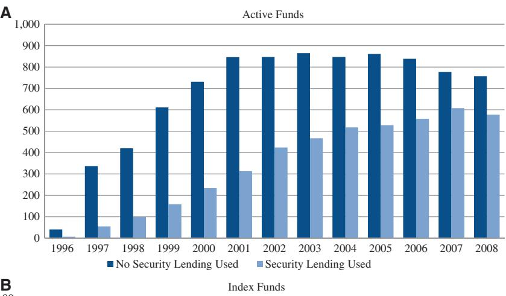
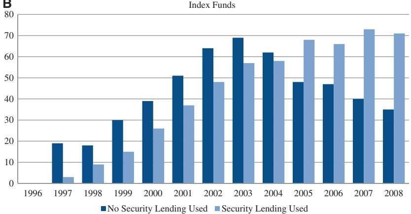

Review of Finance, 2017, 1093–1121 doi: 10.1093/rof/rfw059

Advance Access Publication Date: 5 November 2016

# Fund Performance and Equity Lending: Why Lend What You Can Sell?\*

#### Richard Evans1 , Miguel A. Ferreira2 , and Melissa Porras Prado2

1 University of Virginia Darden School of Business and 2 Nova School of Business and Economics

### Abstract

The dramatic increase in the percentage of mutual funds lending equities suggests that lending fees are an increasingly important source of income for investment advisors. We find that funds that lend equities underperform otherwise similar funds in spite of lending income. The effect of lending is concentrated in funds that cannot act on the short-selling signal due investment restrictions set by the fund family to diversify their fund offerings across styles. Our findings suggest that the family organization explains why fund managers lend, rather than sell, stocks with short selling demand.

JEL classification: G12, G14, G15, G23

Keywords: Mutual funds, Index funds, Performance, Security lending

### 1. Introduction

A securities lending program offers a unique opportunity for mutual funds to generate additional income. By lending the securities in their portfolio, funds earn both interest and appreciation on the collateral of loaned securities. However, borrowing demand from short sellers for a stock is a strong signal of future underperformance. While many investors cannot profit from this short-selling demand signal due to arbitrage limits, in particular the

\* The authors thank Bernard Dumas (the editor), an anonymous referee, John Adams, George Aragon, Lauren Cohen, Nuno Fernandes, Tariq Haque, Andrew Karolyi, Marc Lipson, Pedro Matos, Adam Reed, Jonathan Reuter, Pedro Santa Clara, Clemens Sialm, and Duarte Trigueiros; seminar participants at the Darden School/McIntire School at the University of Virginia, EPFL/University of Lausanne, Georgetown University, Nova School of Business and Economics, Universita Ca'Foscari Venezia, University of Cambridge, University of Geneve, and Universitat Pompeu Fabra; and conference participants at the Oregon Finance Conference, SFS Cavalcade, Lubrafin, 1st Luxembourg Asset Management Summit, Portuguese Finance Network Conference, AEFIN Finance Forum, and Australasian Finance and Banking Conference for helpful comments and suggestions. We thank David Antunes, Andre´ Chen, Andre´ Fernando, Carlos Mirpuri, Naim Patel, Fabio Santos, Filipe Sodagar, and Francisco Vital for outstanding research assistance. Financial support from the European Research Council is gratefully acknowledged.

difficulty in borrowing the stock, fund managers who are long the stock of interest can sell it in order to benefit. Thus, it is an empirical question whether the income generated from security lending outweighs the potential improvement in a fund's performance if the manager sells the stock in response to a short-selling demand signal.1

Using a sample of 1,924 active and 146 passive equity funds over the 1996–2008 period drawn from the SEC's N-SAR filings, we examine security lending practices and their impact on mutual fund performance. We find that willingness to lend shares among US mutual funds has increased dramatically over the sample period. In fact, the percentage of active funds lending securities has increased from 15% in 1996 to 43% in 2008. Security lending is even more pervasive among passive funds at 67% as of 2008. Thus, mutual funds are an important source of lending inventory, representing almost a quarter of the over \$12 trillion global securities lending inventory and double of the percentage of inventory from US pension funds.2 We find that actively managed equity funds that lend securities underperform otherwise similar funds that do not lend. The four-factor risk-adjusted net return difference between funds that lend and those that do not lend is statistically and economically significant at between 0.5% and 0.7% per year. The findings are robust to the inclusion of many family- and fund-level controls, including style and fund fixed effects as well as propensity score matching methods.

Additionally, we find that index funds that lend securities do not underperform otherwise similar index funds as their risk-adjusted performance should not be affected by lending their holdings. Index funds tracking the same index have similar portfolio holdings and returns, and thus index funds that lend securities generate income that increase returns relative to other funds that do not lend. In contrast, active funds can have different holdings, and thus the underperformance of funds that lend securities can be driven endogenously by the holdings (i.e., funds lend the stocks that are demanded by short sellers). These results suggest that the underperformance of active funds is driven by demand effects, which is consistent with the findings of [Kaplan, Moskowitz, and Sensoy \(2013\)](#page-27-0) that the increase in lending supply does not adversely affect equity prices.

If the decision to lend shares is based on the demand from short sellers for a fund's stock holdings, our findings suggest that short sellers are better informed than fund managers. The idea that short sellers are better informed investors is not new, and it is supported by a host of both theoretical and empirical papers.3 This indicates that funds that lend have a long position in the stocks that are most desired by short sellers. What is surprising about

- 1 Research that shows that short selling predicts future negative abnormal returns includes [Brent,](#page-26-0) [Morse, and Stice \(1990\);](#page-26-0) [Senchank and Starks \(1993\)](#page-27-0); [Aitken](#page-25-0) et al. (1998); [Danielsen and Sorescu](#page-26-0) [\(2001\);](#page-26-0) [Dechow](#page-26-0) et al. (2001); [D'Avolio \(2002\);](#page-26-0) Desai et al. [\(2002\);](#page-26-0) [Geczy, Musto, and Reed \(2002\);](#page-26-0) [Jones and Lamont \(2002\);](#page-26-0) [Asquith, Pathak, and Ritter \(2005\);](#page-25-0) [Boehmer, Jones, and Zhang \(2008\);](#page-25-0) [Diether, Werner, and Lee \(2009\)](#page-26-0); [Boehmer, Huszar, and Jordan \(2010\)](#page-25-0); and [Lamont \(2012\)](#page-27-0).
- 2 "Securities Lending Best Practices—A Guidance Paper for U.S. Mutual Funds", 2012, eSecLending, p. 3, September 16, 2014.
- 3 [Diamond and Verrecchia \(1987\)](#page-26-0) argue that given the costs associated with short selling (i.e., loss of proceeds, lending fees, and dividends) investors that engage in shorting are likely to be informed traders. [Engelberg, Reed, and Ringgenberg \(2012\)](#page-26-0) argue that the information advantage of short sellers lies in their ability to process publicly available information. [Christophe, Ferri, and Angel](#page-26-0) [\(2004\);](#page-26-0) [Christophe, Ferri, and Hsieh \(2010\)](#page-26-0); [Karpoff and Lou \(2010\);](#page-27-0) and [Boehmer, Jones, and Zhang](#page-26-0) [\(2015\)](#page-26-0) find evidence that short sellers actually anticipate earnings surprises, financial misconducts, and analyst downgrades.

our fund performance results is that through their security lending operation, fund families and managers receive a clear signal about the demand by short sellers for the stocks in their portfolio but then fail to act on that signal by selling those stock holdings.

One potential explanation for the observed fund underperformance is that the security lending decision is made at the advisor level for family-wide reasons, which is consistent with the idea that family-level profit maximization concerns can dominate fund-level performance concerns (e.g., [Nanda, Wang, and Zheng, 2004;](#page-27-0) [Gaspar, Massa, and Matos,](#page-26-0) [2006](#page-26-0); [Reuter, 2006\)](#page-27-0). Anecdotally, larger fund families often diversify their product offerings across different investment objectives in order to maximize total assets under management and, in turn, family-wide profits. In describing the compensation system at Massachusetts Financial Services (MFS) fund family, Kevin Parke, Chief Investment Officer, explained this strategic consideration:4

"...some types of stocks are always out of favor, and I want our managers to stay with those stocks, picking the best of the worst. When they come back into favor, MFS will be prepared for the inevitable surge in inflows. So I will continue to pay a manager well who is doing a good job in an out-of-favor fund. But they must stick to picking the best stocks in their respective category. I'm not going to reward a value manager who beat her index by including tech stocks (when tech stocks were hot) in her portfolio. That is cheating. We need to build an excellent track record and expertise in each of our asset classes over the long run."

If a manager was allowed complete flexibility in managing their portfolio, decisions to purchase securities outside their investment objective or to switch into and out of cash could potentially harm the fund families' overall product strategy of which funds to offer in each investment objective. If fund managers are restricted from selling stocks in a style in order to accommodate these family-wide strategic considerations, they might be unable to respond to the observed short-selling demand signal.5

Consistent with this idea, we find that funds that lend securities are from larger fund families with fund offerings that are well diversified across investment objectives. Also consistent with these family-wide considerations and the effectiveness of the family's product diversification strategy, we find that families with securities lending programs are better at retaining assets within the family (i.e., outflows from one fund are more likely to be recaptured as inflows to another fund in the family instead of leaving the family altogether).

To assess whether or not manager or investment restrictions prevent these managers from acting on the short-selling signal, we construct two measures: first, we follow [Almazan](#page-25-0) et al. (2004) in constructing an index of fund manager restrictions; second, we use the fund's self-stated benchmark and description of investment strategy to construct an investment restriction index of whether or not the fund has flexibility to invest outside its stated investment mandate. Using either measure, we find that the underperformance of funds that lend stocks is concentrated among funds with greater investment restrictions.

We also show that the restrictions are only relevant if managers face short selling demand that is systematic to their particular style. If the information content inherent in the

- 4 "Massachusetts Financial Services," Harvard Business School Case No. 902-132.
- 5 For example, value fund managers dramatically underperformed growth fund managers in 1999. If value managers started purchasing technology stocks to try and generate similar fund returns, those same managers would have missed the outperformance of value stocks relative to growth stocks after the burst of the Internet bubble.

short selling demand is stock-specific or idiosyncratic, then managers could sell the highly shorted stock and replace it with a stock within the same style without violating its investment mandate and thus improving fund performance. However, if the information content in the short-selling demand is systematic with respect to the stock's style, the investment mandate restrictions would be binding. We find that the underperformance is more pronounced among those funds that face higher systematic shorting demand for their holdings.

While it is difficult to assess a manager's motivation for selling a stock and to control for the characteristics of the stock, we employ a holdings-based test to check the robustness of our results. Specifically, we examine fund holdings for a sample in which a given manager simultaneously manages a fund that is allowed to lend securities and a fund that is not allowed. To assess the strategic implications of security lending, we compare how the manager responds to stocks that are "hard-to-borrow" in the two different funds. We find that managers respond to a short-selling demand signal by selling the stock in their portfolio, but the effect is much larger in the fund that is prohibited from lending versus the fund that is allowed to lend. This result corroborates the interpretation of our findings that those funds that can act upon the information signal received from the stocks in high borrowing demand outperform funds that cannot.

We find little or no evidence for alternative explanations for the observed underperformance like manager overconfidence (as proxied by changes in the active share measure of [Cremers and Petajisto, 2009\)](#page-26-0) or agency costs associated with the use of an affiliated lender. [Adams, Mansi, and Nishikawa \(2014\)](#page-25-0) examine the equity lending practices of index funds and the role of mutual fund boards and affiliated lending agents in negotiating what fraction of the security lending income is kept by the fund. They find that index funds with an affiliated lending agent generate less lending income consistent with agency problems inherent in negotiating with an affiliated agent. We examine whether the relation between performance and equity lending among active funds is explained by the impact of lending agent affiliation. We find that equity lending is more negatively related to performance for funds with affiliated lending agents, but this effect is statistically insignificant in the case of active funds.

Our paper contributes to the understanding of the determinants of mutual fund performance. The literature focuses on the performance consequences associated with portfolio holdings or long stock positions (e.g., [Kacperczyk, Sialm, and Zheng, 2005;](#page-27-0) [Cremers](#page-26-0) [and Petajisto, 2009\)](#page-26-0) and only a few studies examine short stock positions. [Agarwal,](#page-25-0) [Boyson, and Naik \(2009\)](#page-25-0) find that mutual funds that implement hedge fund strategies outperform traditional mutual funds. [Chen, Desai, and Krishnamurthy \(2013\)](#page-26-0) find that funds that short stocks as part of their investment strategy generate significant abnormal performance from both their long and short stock position.

We also contribute to the understanding the economics of security lending, in particular the relation between security lending and performance, and the rationale of fund families in initiating security lending programs. Our paper is related to a recent paper by [Kaplan,](#page-27-0) [Moskowitz, and Sensoy \(2013\)](#page-27-0) that studies the effect on stock prices of a shock to the supply of lendable shares. They conducted an experiment for an anonymous money manager in 2008–09 and find that the returns to stocks that are made available to lend are no different from the other stocks, which suggests that funds can lend out their stocks to earn lending fees without fearing negative consequences for the value of their holdings.

Our paper provides new insights about the fund manager decision to lend shares by studying the impact of stock lending on the performance of a large sample of actively managed mutual funds over an extended period between 1996 and 2008, which contains periods of high and low demand for borrowing stocks. Our results indicate that, on average, equity lending is associated with negative fund performance. Security lending can be a profitable business, but fund managers should be aware of the potential adverse effects on stock prices from lending. This result is not related to the effect of shorting supply on stock prices, but rather to how managers respond to borrowing demand because of the fund family organization. Our paper shows that the decision to lend is made out of strategic familywide considerations, which is consistent with the idea that family-level profit maximization can dominate individual fund performance-maximization.

### 2. Data

Investment companies are required by the Investment Company Act of 1940 to file semiannual and annual N-SAR reports with the SEC. The N-SAR form includes 133 numbered questions related to the investment practices of each fund.6 The responses to these questions provide information on trading activities, including whether or not the fund is allowed by its prospectus to lend securities and whether or not it actually lends equities (question 70N) during the reporting period.

We gather the N-SAR-B annual fund filings from the SEC's Edgar database starting in 1996 and ending in 2008.7 We focus on US open-end domestic equity mutual funds, including both active and index funds. We obtained the filings for 3,113 funds, of which 2,898 are active funds and 215 are index funds. N-SAR reports are filed at a "series" level, which consists of one or more funds. For each fund in the series, we hand collect the CUSIP and ticker. The sample is representative of the US mutual fund industry as it covers 62% of the number of funds and aggregate TNA of equity funds in the CRSP mutual fund database (see Table IA.1 in the [Online Appendix\)](http://rof.oxfordjournals.org/lookup/suppl/doi:10.1093/rof/rfw059/-/DC1).8 Our matched N-SAR-CRSP sample does not differ significantly from the CRSP sample in terms of the fund characteristics such as fund size, age, expense ratio, and turnover.

We then match each fund to the CRSP mutual fund database to collect data on performance and fund characteristics. For funds with multiple share classes, we compute fund-level variables by aggregating across the different share classes and eliminating duplicate share classes. From our sample of US domestic equity funds, we also exclude sector funds, enhanced index funds, and funds with no style category. The final sample covers 2,070 funds, of which 1,924 are active funds and 146 are index funds.

The explanatory variables of interest are dummy variables that equal one for funds that are allowed to lend securities (Security Lending Allowed) and funds that actually lend securities (Security Lending Used) in each year. We also collect the income generated from lending (Security Lending Income) and the collateral used to secure the security loan (Security Lending Collateral) from the annual SEC N-CSR fillings. The income and collateral variables only cover the 2002–08 period.

- 6 A list of the questions and sub-questions is available at: [http://www.sec.gov/info/edgar/forms/N-](http://www.sec.gov/info/edgar/forms/N-SARdoc.htm)[SARdoc.htm](http://www.sec.gov/info/edgar/forms/N-SARdoc.htm).
- 7 Reporting began with a subset of funds in 1993 and was gradually phased in for all funds. All funds were required to report by the end of 1995.
- 8 Other studies that use the N-SAR data include [Edelen \(1999\)](#page-26-0); [Almazan](#page-25-0) et al. (2004); [Reuter \(2006\);](#page-27-0) [Edelen, Evans, and Kadlec \(2012\)](#page-26-0); and [Christoffersen, Evans, and Musto \(2013\).](#page-26-0)

We use several fund-level variables in our analysis. We obtain the holdings for the funds in our sample from Morningstar for the period 1996–2008, and calculate the valueweighted average short interest and institutional ownership of the stocks in the fund's portfolio. We calculate fund utilization, defined as the ratio of the average short interest across the holdings (i.e., the number of shares shorted as a percentage of the number of shares outstanding) to the average institutional ownership for the stocks in the fund's portfolio. Fund utilization controls for the short-selling demand (as proxied by short interest) and the lending supply (as proxied by institutional ownership).

We also calculate a measure of fund manager investment restrictions (Manager Restriction Index). Following [Almazan](#page-25-0) et al. (2004), we construct a fund-level index of investment restrictions in each year using the N-SAR-B fund filings. The index is constructed using the answers to six questions on manager investment restrictions: (1) borrowing of money, (2) margin purchases, (3) short selling, (4) writing or investing in options on equities, (5) writing or investing in stock index futures, and (6) investments in restricted securities. We code the answers as dummy variables that equal one if the fund is restricted. Restrictions are aggregated in three categories: use of leverage (1)–(3), derivatives (4)–(5), and illiquid assets (6). We take the average of the dummies within each category and then take an average of the three categories. The value of the Manager Restriction Index ranges between zero and one, and a higher score indicates a more restricted fund.9

In addition to the manager restriction index, we also calculate a measure of whether or not the fund has flexibility to invest outside its primary investment objective (Investment Restriction Index). This index relies both on the fund's self-stated benchmark and description of the investment strategy taken from the prospectus. Specifically, this restriction index has five components: style (growth/value and small/mid/large cap), international, fixed income, and diversification restrictions, and a measure of the investment mandate complexity (total word count as a percentage of the average word count for other funds with the same benchmark). The investment restriction index compares the style classification of the fund's benchmark (e.g., the S&P 500 index is a large cap index) with the self-imposed restrictions the fund describes in its investment strategy description (e.g., "[The Fund] primarily invests in medium- and large-companies"). If the fund benchmark has a specific style tilt (e.g., the Russell 2000 Value Index is tilted toward small cap value stocks), the restriction measure counts the number of dimensions of self-imposed style restrictions mentioned in the fund investment summary. For example, a fund tracking the Russell 2000 Value index that specifically mentions that it cannot invest in mid cap (þ1), large cap (þ1), and growth (þ1) stocks receives a style restriction measure of 3. If the fund mentions that it can invest in mid cap stocks, it receives a style restriction measure of 2. If the fund mentions that it can invest in large cap and value stocks, it receives a style restriction measure of 1.

9 We also construct an alternative restriction index that includes the additional investment allowance/restriction questions in the N-SAR fillings: writing or investing in repurchase agreements, options on equities, options on debt securities, options on stock indices, interest rate futures, stock index futures, options on futures, options on stock index futures, other commodity futures; investments in restricted securities, shares of other investment companies, securities of foreign issuers; currency exchange transactions; loaning portfolio securities; borrowing of money; purchases/sales by certain exempted affiliated persons; margin purchases; and short selling. The results using this alternative index are similar to those presented in the paper.

Given that our sample of funds is limited to US domestic equity funds, we also measure whether or not a fund is restricted to invest in international stocks and fixed income according to the investment strategy description. The international restriction measure takes a value of zero (one) if the fund is allowed (not allowed) to invest internationally. The fixed income restriction measure takes a value of zero (one) if the fund is allowed (not allowed) to invest in fixed income.

While the Investment Company Act of 1940 has specific requirements regarding the portfolio concentration for diversified funds, those funds that are undiversified may hold more concentrated portfolios. The diversified restriction equals zero for those funds that specifically indicate they are undiversified, and one otherwise. The final component of the investment restriction index is the investment mandate complexity measure. This measure is calculated by dividing the total word count of the fund's investment strategy description by the average word count for other funds with the same self-stated benchmark. Those funds with longer investment strategy descriptions tend to have lower tracking error relative to their benchmark, which is indicative of more restrictions. The index is constructed by summing the five components. The value of the Investment Restriction Index ranges between 0 and 8, and a higher score indicates a more restricted fund.

[Almazan](#page-25-0) et al. (2004) manager restriction index focus on the restrictions placed on a manager. An alternative way to construct this index is to look at additional flexibility that a manager might have. If funds are allowed to trade options or futures they could be used to hedge the future expected underperformance of the stocks held by the fund with short selling demand. Using the N-SAR data, we create an index (Options-Futures Allowed) using the answers to eighth questions on whether the fund is allowed to trade futures and options: equity options, debt options, index options, stock futures, option futures, commodity futures, interest rate futures, and option index futures. We code the answers as dummy variables that equal one if the fund is allowed to trade, and then take an average of the eighth categories. The value of the Options-Futures Allowed index ranges between 0 and 1, and a higher score indicates a more restricted fund.

Finally, we construct a measure of the systematic versus idiosyncratic short selling demand of each fund based on its holdings. For each stock in the fund's portfolio, we run a regression of the stock short interest on the average short interest of style-based portfolios: two portfolios formed on market capitalization and two portfolios formed on book-tomarket equity ratio. The short interest ratio (i.e., the number of shares shorted as a percentage of the number of shares outstanding) individual stock-level regression is given by:

$$SI_{it} = \alpha_i + \beta_{1i}SI\_Market_t + \beta_{2i}SI\_Small_t + \beta_{3i}SI\_Big_t + \beta_{4i}SI\_Growth_t + \beta_{5i}SI\_Value_t + \epsilon_{it,}$$
(1)

where SIRi,t is the short interest ratio of stock i in month t; SIR\_Markett is the average market short interest ratio across all stocks in CRSP in month t; SIR\_Smallt is the average short interest ratio across small stocks in month t; SIR\_Bigt is the average short interest ratio across big stocks in month t; SIR\_Growtht is the average short interest ratio across growth stocks in month t; and SIR\_Valuet is the average short interest ratio across value stocks in month t.

We construct the style portfolios at the end of each June using the [Fama and French](#page-26-0) [\(1992\)](#page-26-0) procedure. We rank stocks in the CRSP database according to their market capitalization and book-to-market equity ratio. The market capitalization breakpoints are the 20th and 80th percentiles of the market capitalization as of the end of June. The bottom 20% is designated as the small portfolio and the highest 20% as the big portfolio. The

Table I. Summary statistics

This table presents mean, median, standard deviation, and number of observations for each variable. The sample consists of domestic equity mutual funds with N-SAR filings and CRSP mutual funds data over the 1996–2008 period. Refer to [Table AI](#page-27-0) in the Appendix for variable definitions.

|                                      | Mean     | Median   | Standard deviation | Observations |
|--------------------------------------|----------|----------|--------------------|--------------|
| Excess return (%)                    | 0.09     | 0.50     | 4.86               | 120,177      |
| Four-factor alpha (%)                |  0.14 |  0.14 | 1.87               | 120,177      |
| Security lending allowed             | 0.85     | 1.00     | 0.35               | 120,177      |
| Security lending used                | 0.42     | 0.00     | 0.49               | 120,177      |
| Security lending income              | 0.01     | 0.00     | 0.04               | 99,798       |
| Security lending collateral          | 0.03     | 0.00     | 0.07               | 96,502       |
| Fund short interest (%)              | 2.23     | 1.22     | 2.61               | 120,177      |
| Fund institutional ownership (%)     | 65.01    | 62.64    | 11.77              | 120,177      |
| Fund utilization (%)                 | 3.10     | 2.01     | 2.99               | 120,177      |
| Expense ratio (%)                    | 1.24     | 1.22     | 0.50               | 120,177      |
| TNA (\$millions)                     | 1,811    | 315      | 6,963              | 120,129      |
| Net flow (%)                         | 0.38     | 0.23  | 4.51               | 120,138      |
| Turnover (%)                         | 87.29    | 65.00    | 91.96              | 120,177      |
| Family TNA (\$billions)              | 206,187  | 29,033   | 781,536            | 120,177      |
| Investment objective Herfindahl      | 0.33     | 0.20     | 0.29               | 120,177      |
| Average family performance rank      | 2.00     | 2.00     | 0.72               | 120,168      |
| Average family expense ratio (%)     | 1.27     | 1.27     | 0.41               | 120,177      |
| Average family active share (%)      | 77.28    | 77.61    | 10.05              | 117,463      |
| Index funds in family (% total)      | 6.39     | 0.00     | 12.45              | 120,177      |
| Subadvised funds in family (% total) | 3.12     | 0.00     | 9.00               | 120,177      |
| Broker funds in family (% total)     | 29.29    | 30.00    | 21.14              | 120,177      |
| Manager restriction index            | 0.53     | 0.56     | 0.15               | 120,177      |
| Investment restriction index         | 4.58     | 5.00     | 2.81               | 101,894      |
| Options-futures allowed              | 0.68     | 0.88     | 0.35               | 120,177      |
| Systematic shorting (R2 )         | 0.75     | 0.75     | 0.07               | 94,017       |
| Active share (%)                     | 73.05    | 78.66    | 22.40              | 107,328      |
| Affiliated lending agent             | 0.09     | 0.00     | 0.29               | 120,177      |

book-to-market breakpoints are the 20th and 80th percentiles of the book-to-market ratio as of the end of June (book equity for the last fiscal year end of the previous calendar year divided by market capitalization for December of the previous calendar year). The bottom 20% is designated as the growth portfolio and the highest 20% as the value portfolio.

Every month we estimate the time series regression in [Equation \(1\)](#page-6-0) of short interest ratio of each stock on style-portfolios' average short interest ratio using the previous 12 months of data. The R2 of this regression captures how much of the variation in the short interest is due to the systematic shorting demand based on styles. In a final step, we calculate the fund-level proxy measure of systematic shorting by taking a weighted average of the individual stock R2 across all stocks in the fund portfolio (Systematic Shorting). Given the bounded nature of the R2 , we use the logistic transformation of R2 as proxy for systematic shorting.

Table I provides summary statistics for all the variables used in our analysis. The monthly four-factor Carhart alphas are calculated using factor exposures estimated over

Table II. Frequency of security lending by mutual funds

Panel A reports the number of active and index equity funds that are allowed and engage in security lending by year. The sample consists of domestic equity mutual funds with N-SAR filings and CRSP mutual funds data over the 1996–2008 period. Panel B reports the transition probabilities for the security lending allowed and security lending used states. Refer to [Table AI](#page-27-0) in the Appendix for variable definitions.

Panel A: Number of funds

|      | Active funds       |                                |                             | Index funds                     |                    |                                |                             |                                 |
|------|--------------------|--------------------------------|-----------------------------|---------------------------------|--------------------|--------------------------------|-----------------------------|---------------------------------|
| Year | Number of funds | Security lending allowed | Security lending used | Security lending used (%) | Number of funds | Security lending allowed | Security lending used | Security lending used (%) |
| 1996 | 48                 | 38                             | 7                           | 15                              |                    |                                |                             |                                 |
| 1997 | 392                | 281                            | 55                          | 14                              | 22                 | 13                             | 3                           | 14                              |
| 1998 | 519                | 389                            | 99                          | 19                              | 27                 | 20                             | 9                           | 33                              |
| 1999 | 770                | 595                            | 159                         | 21                              | 45                 | 33                             | 15                          | 33                              |
| 2000 | 965                | 764                            | 234                         | 24                              | 65                 | 54                             | 26                          | 40                              |
| 2001 | 1,159              | 938                            | 313                         | 27                              | 88                 | 77                             | 37                          | 42                              |
| 2002 | 1,271              | 1,072                          | 424                         | 33                              | 112                | 100                            | 48                          | 43                              |
| 2003 | 1,332              | 1,102                          | 467                         | 35                              | 126                | 118                            | 57                          | 45                              |
| 2004 | 1,365              | 1,140                          | 518                         | 38                              | 120                | 113                            | 58                          | 48                              |
| 2005 | 1,389              | 1,154                          | 528                         | 38                              | 116                | 113                            | 68                          | 59                              |
| 2006 | 1,396              | 1,174                          | 558                         | 40                              | 113                | 110                            | 66                          | 58                              |
| 2007 | 1,385              | 1,190                          | 608                         | 44                              | 113                | 109                            | 73                          | 65                              |
| 2008 | 1,334              | 1,152                          | 577                         | 43                              | 106                | 100                            | 71                          | 67                              |

Panel B: Transition probabilities (%)

| Security lending allowed |     |      | Security lending used |     |      |
|--------------------------|-----|------|-----------------------|-----|------|
|                          | Not | Yest |                       | Not | Yest |
| Not 1                 | 84% | 16%  | Not 1              | 92% | 8%   |
| Yest 1                | 2%  | 98%  | Yest 1             | 10% | 90%  |

### Index funds

| Security lending allowed |     |      | Security lending used |     |      |
|--------------------------|-----|------|-----------------------|-----|------|
|                          | Not | Yest |                       | Not | Yest |
| Not 1                 | 60% | 40%  | Not 1              | 87% | 13%  |
| Yest 1                | 2%  | 98%  | Yest 1             | 6%  | 94%  |

the previous 36 months. The average four-factor alpha is slightly negative (14 basis points per month), which is consistent with previous studies. Fund characteristics include total net assets (TNAs), net fund flow as a percentage of TNA, expense ratio, and fund turnover. The variables also include fund family characteristics such as family TNA, investment objective Herfindahl, performance rank quintile within the investment objective, expense

ratio, active share (of actively managed funds), and percentage of index funds, subadvised funds, and funds sold through brokers in the family. [Table AI](#page-27-0) in the Appendix provides variable definitions.

In addition to the summary statistics, we also examine the time series changes of security lending among mutual funds. Panel A of [Table II](#page-8-0) and [Figure 1](#page-10-0) show a dramatic increase in both the percentage of active funds that are allowed to lend securities and the percentage of funds that actually lend securities. Before 2000, less than 25% of the active funds actually lent their stock holdings. In the 2000s, the percentage of active funds lending out their holdings increased significantly, reaching 43% in 2008. The percentage of index funds engaging in security lending has always been higher relative to that of active funds, but we also observe an increase in the willingness to lend securities in recent times. The percentage of index funds lending their holdings increased significantly from 14% in 1997 to 67% in 2008.

Panel B of [Table II](#page-8-0) shows the transition probabilities between the different security lending states. During the sample period, 16% of active funds and 40% of index funds switch from prohibiting to allowing security lending, while only 2% of the active and index funds switch from allowing to prohibiting security lending.

### 3. Security Lending and Fund Performance

In this section, we study the relation between security lending and fund performance. A fund generates additional income when it lends its stock holdings, but the short-selling (borrowing) demand for a stock is a strong signal of future underperformance. It is an empirical question whether or not the income generated from stock lending outweighs the potential gain a manager could obtain by responding to this short-selling demand signal by selling the stock. We examine this trade-off through the analysis of the fund's risk-adjusted performance and security lending.

### 3.1 Multivariate Regression Results

We first estimate panel regressions of monthly fund after-fee performance on the security lending used dummy and other fund characteristics. The dependent variable is the fund's monthly four-factor alphas. We control for short-selling demand and supply using the fund utilization variable. Other control variables include the expense ratio, TNAs, net flow, turnover, family TNA, the percentage of funds sold through brokers in the family, and past performance. The standard errors are clustered at the fund level to correct for within-fund correlation.

[Table III](#page-11-0) presents the regression estimates. Panel A shows the estimates for the sample of active funds and Panel B for the sample of index funds. Column (1), Panel A, shows a negative and significant relation between fund performance and security lending. This indicates that active funds that lend out their stock holdings underperform otherwise similar funds that do not make their holdings available to the lending market. The effect is economically important as funds that lend their holdings underperform other funds by about 6 basis points per month in terms of four-factor alphas.

The coefficients of the other fund characteristics are in line with previous studies. Fund size is negatively related to performance, while family size is positively related [\(Chen](#page-26-0) et al., [2004](#page-26-0)). Expenses negatively impact performance ([Malkiel, 1995](#page-27-0); [Carhart, 1997;](#page-26-0) [Gil-Bazo](#page-26-0) [and Ruiz-Verdu, 2009\)](#page-26-0), and broker-sold funds underperform even after controlling for

Figure 1. Security lending use by year. This figure reports the number of active funds (Panel A) and index funds (Panel B) that lend their stock holdings and that do not lend their stock holdings by year. The sample consists of domestic equity mutual funds with N-SAR filings and CRSP mutual funds data over the 1996–2008 period.

expenses ([Bergstresser, Chalmers, and Tufano, 2009](#page-25-0)). It is interesting to note that the coefficient on the level of utilization of the fund's portfolio holdings is negative and significant, which is consistent with the evidence of a negative relation between short-selling demand and future stock performance.

To address the potential concern that the fund performance result is due to an omitted variable such as portfolio manager skill and style differences, Columns (2)–(4) include investment style fixed effects (based on the nine Morningstar investment objective categories), investment style-by-time fixed effects, and fund fixed effects, respectively. This controls for unobserved sources of fund heterogeneity and addresses the joint determination problem in which an unobserved time-invariant variable simultaneously determines fund performance and security lending. The economic magnitude of the security lending effect on performance remains sizable in all specifications. Funds that lend out securities underperform similar funds that are allowed to lend but refrain of doing so by 4–6 basis points

Table III. Fund performance and security lending: multivariate regression

This table reports estimates of ordinary least squares and fixed effects regressions of the Carhart four-factor alphas (in percentage per month) on the security lending used dummy and lagged fund characteristics for active funds (Panel A) and index funds (Panel B). The sample consists of domestic equity mutual funds with N-SAR filings and CRSP mutual funds data over the 1996–2008 period. Refer to [Table AI](#page-27-0) in the Appendix for variable definitions. Robust t-statistics in parentheses are based on standard errors clustered by fund. \*\*\*, \*\*, and \* denote that the coefficient is significant at the 1%, 5%, and 10% levels, respectively.

| Panel A: Active funds     |              |              |              |              |
|---------------------------|--------------|--------------|--------------|--------------|
|                           | (1)          | (2)          | (3)          | (4)          |
| Security lending used     |  0.059*** |  0.056*** |  0.040*** |  0.040*   |
|                           | ( 4.49)   | ( 4.35)   | ( 3.26)   | ( 1.66)   |
| Fund utilization          |  0.010*** |  0.008**  | 0.005        |  0.010**  |
|                           | ( 4.33)   | ( 2.50)   | (1.24)       | ( 2.39)   |
| Expense ratio             |  0.017    |  0.016    |  0.019    | 0.084        |
|                           | ( 0.83)   | ( 0.80)   | ( 0.91)   | (1.50)       |
| ln(TNA)                   |  0.010**  |  0.011**  |  0.015*** |  0.232*** |
|                           | ( 2.31)   | ( 2.52)   | ( 3.63)   | ( 16.60)  |
| Net flow                  | 0.008***     | 0.007***     | 0.007***     | 0.001        |
|                           | (5.15)       | (4.95)       | (4.74)       | (0.54)       |
| Turnover                  |  0.056*** |  0.053*** |  0.045*** | 0.014        |
|                           | ( 5.21)   | ( 4.75)   | ( 4.30)   | (0.76)       |
| ln(Family TNA)            | 0.004        | 0.002        | 0.004*       | 0.015        |
|                           | (1.29)       | (0.87)       | (1.66)       | (1.12)       |
| Broker funds in family    | 0.001***  | 0.001***  | 0.001***  | 0.002**   |
|                           | ( 3.16)   | ( 3.46)   | ( 3.75)   | ( 2.19)   |
| Four factor alphat 1   | 0.013***     | 0.012***     | 0.021***     | 0.009**   |
|                           | (3.05)       | (2.87)       | (4.34)       | ( 2.09)   |
| Constant                  | 0.036        |              |              |              |
|                           | (0.90)       |              |              |              |
| Style fixed effects       | No           | Yes          | Yes          | No           |
| Style  Time fixed effects | No           | No           | Yes          | No           |
| Fund fixed effects        | No           | No           | No           | Yes          |
| Observations              | 111,484      | 111,484      | 111,484      | 111,484      |
| R2                        | 0.002        | 0.003        | 0.216        | 0.006        |
| Number of funds           | 1,701        | 1,701        | 1,701        | 1,701        |
| Panel B: Index funds      |              |              |              |              |
|                           | (1)          | (2)          | (3)          | (4)          |
| Security lending used     |  0.014    |  0.017    | 0.005        |  0.049    |
|                           | ( 0.52)   | ( 0.66)   | (0.22)       | ( 0.87)   |
| Fund utilization          | 0.002        | 0.006*       | 0.010**      | 0.015***     |
|                           | (1.13)       | (1.67)       | (2.40)       | (2.88)       |
| Expense ratio             |  0.131*** |  0.126*** |  0.096*** |  0.285    |
|                           | ( 3.74)   | ( 3.90)   | ( 3.88)   | ( 1.36)   |

(continued)

| Panel B: Index funds      | (1)         |            |            |              |
|---------------------------|-------------|------------|------------|--------------|
|                           |             |            |            |              |
|                           |             | (2)        | (3)        | (4)          |
| ln(TNA)                   | 0.007       | 0.005      |  0.002  |  0.060    |
|                           | (0.85)      | (0.70)     | ( 0.25) | ( 1.56)   |
| Net flow                  | 0.005       | 0.005      | 0.009      | 0.004        |
|                           | (0.85)      | (0.80)     | (1.23)     | (0.65)       |
| Turnover                  |  0.009   | 0.017      |  0.028  | 0.174***     |
|                           | ( 0.60)  | (0.75)     | ( 1.46) | (4.06)       |
| ln(Family TNA)            | 0.020**  | 0.015   | 0.011   | 0.089***  |
|                           | ( 2.10)  | ( 1.38) | ( 0.99) | ( 3.47)   |
| Broker funds in family    | 0.000       | 0.000      | 0.000   | 0.002     |
|                           | (0.75)      | (0.09)     | ( 0.86) | ( 0.83)   |
| Four factor alphat 1   | 0.025    | 0.029   | 0.014      | 0.051***  |
|                           | ( 1.20)  | ( 1.39) | (0.61)     | ( 2.67)   |
| Constant                  | 0.161*      |            |            |              |
|                           | (1.80)      |            |            |              |
| Style fixed effects       | No          | Yes        | Yes        | No           |
| Style  Time fixed effects | No          | No         | Yes        | No           |
| Fund fixed effects        | No          | No         | No         | Yes          |
| Observations              | 8,693       | 8,693      | 8,693      | 8,693        |
| R2                        | 0.004       | 0.009      | 0.639      | 0.010        |
| Number of funds           | 129         | 129        | 129        | 129          |

per month. Overall, the results on the sample of active funds suggest that the adverse effects on fund performance from continuing to hold stocks with strong short-selling demand outweigh the additional income generated by lending these stocks.

While managers of active funds have discretion over whether or not to buy, sell or hold a given stock, index fund managers have much less discretion. Because their objective is to track as closely as possible the performance of their stated index, passive fund managers likely do not focus on the future out- or underperformance of a stock, but rather they focus on whether or not it belongs to the index they are tracking. Given this fundamentally different goal for buying, selling, or holding stocks, index funds serve as an important falsification test. If our interpretation of the findings for active funds is correct, we should not find a negative relationship between security lending and the performance of index funds. To assess whether or not this is the case, we separately estimate the security lending used coefficient for the sample of index funds. Panel B of [Table III](#page-11-0) presents the results. Consistent with our interpretation, the security lending used variable is statistically insignificant in all specifications.

### 3.2 Propensity Score Matching Results

Matching methods alleviate concerns associated with linear regressions and mitigate asymptotic biases arising from self-selection. We use propensity score matching to compare the difference in performance of both active and index funds that lend securities (treated sample) with funds that do not lend securities (control sample). We estimate a probit of the fund's decision to lend securities (dependent variable is the security lending

Table IV. Probit of security lending used

This table reports estimates of probit regression of the fund decision to lend securities using lagged fund and family characteristics as explanatory variables. The sample consists of domestic equity mutual funds with N-SAR filings and CRSP mutual funds data over the 1996–2008 period. Refer to [Table AI](#page-27-0) in the Appendix for variable definitions. Robust t-statistics in parentheses are based on standard errors clustered by fund. \*\*\*, \*\*, and \* denote that the coefficient is significant at the 1%, 5%, and 10% levels, respectively.

|                                 | (1)          | (2)          |  |  |
|---------------------------------|--------------|--------------|--|--|
|                                 | Active funds | Index funds  |  |  |
| Fund utilization                | 0.021**      |  0.016    |  |  |
|                                 | (2.55)       | ( 0.86)   |  |  |
| Expense ratio                   |  0.084    |  0.386    |  |  |
|                                 | ( 0.93)   | ( 0.90)   |  |  |
| ln(TNA)                         | 0.103***     | 0.233***     |  |  |
|                                 | (5.35)       | (3.34)       |  |  |
| Net flow                        | 0.014***  | 0.022***  |  |  |
|                                 | ( 4.90)   | ( 3.14)   |  |  |
| Turnover                        | 0.001        | 0.194*       |  |  |
|                                 | (0.03)       | (1.80)       |  |  |
| ln(Family TNA)                  | 0.065***     | 0.330***     |  |  |
|                                 | (3.79)       | (3.88)       |  |  |
| Investment objective Herfindahl |  0.425*** | 1.157*       |  |  |
|                                 | ( 3.20)   | (1.68)       |  |  |
| Average family performance rank |  0.032**  |  0.023    |  |  |
|                                 | ( 2.26)   | ( 0.36)   |  |  |
| Average family expense ratio    |  7.828    |  64.028   |  |  |
|                                 | ( 0.74)   | ( 1.59)   |  |  |
| Average family active share     |  1.758*** | 1.425        |  |  |
|                                 | ( 5.93)   | (1.39)       |  |  |
| Index funds in family           | 0.220        |  1.908*   |  |  |
|                                 | (0.66)       | ( 1.91)   |  |  |
| Subadvised funds in family      | 0.598*       | 1.563        |  |  |
|                                 | (1.81)       | (0.75)       |  |  |
| Broker funds in family          | 0.822**   | 4.489        |  |  |
|                                 | ( 2.40)   | (1.45)       |  |  |
| Four factor alphat 1         | 0.006***  | 0.024*    |  |  |
|                                 | ( 2.71)   | ( 1.75)   |  |  |
| Style fixed effects             | Yes          | Yes          |  |  |
| Observations                    | 92,820       | 8,074        |  |  |

used dummy variable) based on family and fund characteristics. In each month, we match each fund that lends securities with a fund that does not lend securities with the closest propensity score (nearest neighbor estimator) in the same Morningstar investment objective (in the case of active funds) or tracking the same underlying index (in the case of index funds).

Table IV reports the estimates of the probit of the fund security lending decision. Column (1) is for the sample of active funds, while Column (2) uses the sample of index funds. In addition to providing a basis for selecting the control sample, the probit regression provides insights into the economics of securities lending. For the sample of active funds, larger underperforming funds with lower flows from larger fund families in which less funds are sold through brokers are more likely to initiate a security lending program. Families with lower average fund performance, as measured by the average fund performance rank within the investment objective, are also more likely to initiate a security lending program. Families with lower average active share across funds are also more likely to allow lending. Perhaps, not surprisingly, funds with a higher utilization rate are more likely to lend as well.

Families with more diverse fund offerings across investment objectives, as proxied by the Herfindahl index of TNAs in each investment objective, are more likely to allow security lending. The results suggest that initiating a security lending program is a family-wide decision related, in part, to the diversification of the family's overall product offerings across investment objectives. These results are consistent with [Rizova \(2012\)](#page-27-0) that shows that security lending is a family-level decision driven by economies of scale and past performance.

For index funds, the fund size, performance, family size, and net flow results are similar. However, index funds that lend shares are more likely to come from a family with offerings concentrated in a particular investment objective. Given the disproportionate size of index funds tracking the S&P 500, this result may arise from families with index fund operations concentrated in large cap investment objectives.

[Table V](#page-15-0) shows a comparison of average fund performance and characteristics between the treated and non-treated samples, and between the treated and control samples. The control samples for the active and index funds are identified using the probit regression estimates in Columns (1) and (2) of [Table IV.](#page-13-0) Panel A of [Table V](#page-15-0) presents the comparison for active funds and Panel B presents the comparison for index funds.

[Table V](#page-15-0) confirms the results of [Table III](#page-11-0) for both active and index funds. The average active fund in the treated sample has a negative four-factor alpha of 18.3 basis points per month and the average fund in the control sample has a negative alpha of 14.5 basis points per month. The estimated effect on risk-adjusted performance of security lending is a statistically significant 3.8 basis points per month, which is similar to the estimate in [Table III](#page-11-0). For index funds, there is a negative and statistically insignificant difference when comparing the treated to non-treated samples, but when using the matched control sample, the difference is positive and statistically insignificant at 1.7 basis points. Looking at the other variables in [Table V](#page-15-0), we see that there are significant differences between the treated and non-treated samples, but the control sample constructed using the propensity score matching method is closer to the treated sample for the majority of fund characteristics.10 As a robustness check, we also run a regression of the differences in four-factor alpha performance between treated and propensity score matched control funds but controlling for the characteristics with statistically significant differences. The differences (untabulated) in four-factor alphas are similar at -3.2 basis points for active funds and 1 basis point for index funds.

#### 3.3 Effect of Investment Restrictions and Alternative Hypotheses

We have shown that actively managed funds that lend securities underperform otherwise similar funds that do not lend securities. This is perhaps not surprising given the

10 If we do not require the control sample to match the date and investment objective/benchmark exactly, the differences between treated and control funds improve substantially, but the performance results are similar to those in [Table V.](#page-15-0)

Table V. Fund performance and security lending: propensity-score matching

This table reports the comparison of fund performance and other variables between the treated (funds that lend equities), non-treated, and control samples. The control sample of funds is constructed using the fund in the same month and style with the closest propensity score to the treated fund where the propensity scores are determined by the probit regressions (1) and (2) of [Table IV](#page-13-0) for active and index funds, respectively. For active funds, style is given by the Morningstar investment objective categories. For index funds, style is given by the self-stated benchmark. Panel A gives the results for active funds and Panel B gives the results for index funds. The differences are given for the variables used in the probit model of [Table IV](#page-13-0) and the difference in the Carhart fourfactor alphas (in percentage per month) between the treated and control fund groups. The sample consists of domestic equity mutual funds with N-SAR filings and CRSP mutual funds data over the 1996–2008 period. Refer to [Table AI](#page-27-0) in the Appendix for variable definitions. \*\*\*, \*\*, and \* denote that the coefficient is significant at the 1%, 5%, and 10% levels, respectively.

Panel A: Active funds

|                                  | Treated   | Non-treated | Difference   | Treated   | Control   | Difference   |
|----------------------------------|-----------|-------------|--------------|-----------|-----------|--------------|
| Four-factor alpha (%)            | 0.184  | 0.128    | 0.055***  | 0.183  | 0.145  | 0.038**   |
| Fund utilization (%)             | 3.172     | 3.139       | 0.033        | 3.173     | 3.389     |  0.216*** |
| Expense ratio (%)                | 1.240     | 1.375       | 0.135***  | 1.240     | 1.223     | 0.017***     |
| ln(TNA)                          | 6.148     | 5.418       | 0.730***     | 6.148     | 6.089     | 0.059***     |
| Net flow (%)                     | 0.021     | 0.547       | 0.526***  | 0.020     | 0.053     | 0.033     |
| Turnover (%)                     | 87.648    | 95.090      |  7.442*** | 87.645    | 89.904    |  2.259*** |
| ln(Family TNA)                   | 10.809    | 9.467       | 1.342***     | 10.808    | 10.760    | 0.048*       |
| Investment objective Herfindahl  | 0.257     | 0.375       |  0.118*** | 0.258     | 0.249     | 0.008***     |
| Average family performance rank  | 1.985     | 2.002       |  0.017*** | 1.984     | 2.001     |  0.016**  |
| Average family expense ratio (%) | 1.235     | 1.366       |  0.132*** | 1.235     | 1.232     | 0.003        |
| Average family active share (%)  | 75.127    | 79.247      |  4.120*** | 75.136    | 75.686    |  0.550*** |
| Index funds in family (% total)  | 6.599     | 4.025       | 2.574***     | 6.593     | 5.943     | 0.651***     |
| Subadvised funds in family       | 2.566     | 2.742       |  0.177*** | 2.565     | 2.582     |  0.017    |
| (% total)                        |           |             |              |           |           |              |
| Broker funds in family (% total) | 2.843     | 5.998       |  3.156*** | 2.842     | 3.309     |  0.467*** |
| Four factor alphat 1 (%)      |  0.181 |  0.122   |  0.058*** |  0.180 |  0.162 |  0.018    |

Panel B: Index funds

|                                  | Treated   | Non-treated | Difference   | Treated   | Control   | Difference    |
|----------------------------------|-----------|-------------|--------------|-----------|-----------|---------------|
| Four-factor alpha (%)            |  0.075 |  0.033   |  0.041    |  0.083 |  0.100 | 0.017         |
| Fund utilization (%)             | 2.877     | 3.118       |  0.242*** | 2.393     | 2.285     | 0.109         |
| Expense ratio (%)                | 0.452     | 0.546       | 0.094***  | 0.450     | 0.661     | 0.212***   |
| ln(TNA)                          | 7.016     | 5.300       | 1.716***     | 7.003     | 5.707     | 1.295***      |
| Net flow (%)                     | 0.608     | 1.183       | 0.576***  | 0.415     | 0.132     | 0.284         |
| Turnover (%)                     | 40.330    | 43.300      |  2.970    | 20.184    | 39.558    |  19.374*** |
| ln(Family TNA)                   | 11.866    | 9.720       | 2.146***     | 11.613    | 10.898    | 0.715***      |
| Investment objective Herfindahl  | 0.203     | 0.224       |  0.021*** | 0.207     | 0.228     |  0.021**   |
| Average family performance rank  | 2.035     | 1.998       | 0.037***     | 2.021     | 1.892     | 0.129***      |
| Average family expense ratio (%) | 0.963     | 1.075       |  0.112*** | 0.996     | 1.242     |  0.246***  |
| Average family active share (%)  | 72.857    | 71.027      | 1.830***     | 72.568    | 75.871    |  3.303***  |
| Index funds in family (% total)  | 24.779    | 24.522      | 0.257        | 21.450    | 17.041    | 4.409***      |
|                                  |           |             |              |           |           |               |

(continued)

Table V. Continued

| Panel B: Index funds |  |
|----------------------|--|
|----------------------|--|

|                                         | Treated   | Non-treated | Difference   | Treated   | Control   | Difference   |
|-----------------------------------------|-----------|-------------|--------------|-----------|-----------|--------------|
| Subadvised funds in family (% total) | 1.665     | 2.985       |  1.320*** | 2.036     | 4.124     |  2.088*** |
| Broker funds in family (% total)        | 1.144     | 1.072       | 0.072        | 1.387     | 1.517     |  0.130*** |
| Four factor alphat 1 (%)             |  0.078 |  0.031   |  0.047*   |  0.090 |  0.120 | 0.030        |

documented relation between short-selling demand and the future underperformance of a stock. What is surprising is that fund managers receive a clear signal about the demand by short sellers for their stock holdings but then choose to lend the stocks instead of selling them in anticipation of the future price decrease. Why would they fail to act upon this signal?

One potential explanation is that fund managers might be limited in their ability to act upon the information signal. [Almazan](#page-25-0) et al. (2004) show that management companies confine managers' investment decisions through the use of various restrictions. In the N-SAR form (question 70N) mutual funds are asked to provide information on their investment activities and whether or not they are prohibited from using certain investment strategies. Following [Almazan](#page-25-0) et al. (2004), we compute an index of the investment restrictions that a manager faces in the usage of leverage, derivatives, and illiquid assets (Manager Restriction Index). We interact the Manager Restriction Index with the Security Lending Used dummy variable to see how investment restrictions affect the relation between fund performance and security lending. If this channel explains our findings, we should find that the interaction variable coefficient is negative and significant.

[Table VI](#page-17-0) presents the estimate of performance regressions similar to those in [Table III](#page-11-0) with additional explanatory variables. The samples include only active funds and the specification includes style-by-time fixed effects.11 Column (1) includes the interaction Manager Restriction Index Security Lending Used interaction variable. The coefficient on this interaction is negative and significant. The interpretation is that the negative effect of equity lending on fund performance is concentrated among funds in which managers face more investment restrictions. This is consistent with security lending only negatively affecting fund performance when funds are restricted from selling stock holdings even though they observe the short-selling demand signal.

In addition to the manager restriction index, we run this analysis using an investment restriction index. This index captures the self-imposed investment restrictions a fund places upon itself relative to its benchmark (Investment Restriction Index). We include the Investment Restriction Index in the regression as well as its interaction with the Security Lending Used dummy variable in Column (2). While the Investment Restriction Index coefficient is statistically insignificant, the interaction coefficient is negative and statistically significant. In addition, the Security Lending Used coefficient is no longer negative, and it becomes positive and significant. This suggests that the underperformance is driven by

Table VI. Fund performance and security lending: effect of investment restrictions, systematic shorting, affiliated lending agents, and manager overconfidence

This table reports estimates of ordinary least squares regressions of the Carhart four-factor alphas (in percentage per month) on the security lending used dummy and lagged fund characteristics. The sample consists of domestic active equity mutual funds with N-SAR filings and CRSP mutual funds data over the 1996–2008 period. Refer to [Table AI](#page-27-0) in the Appendix for the other variable definitions. Robust t-statistics in parentheses are based on standard errors clustered by fund. \*\*\*, \*\*, and \* denote that the coefficient is significant at the 1%, 5%, and 10% levels, respectively.

|                              | (1)         | (2)         | (3)          | (4)         | (5)          | (6)          |
|------------------------------|-------------|-------------|--------------|-------------|--------------|--------------|
| Security lending used        | 0.058       | 0.193*      |  0.095*** | 0.055       |  0.043*** |  0.045*** |
|                              | (1.28)      | (1.77)      | ( 2.92)   | (1.31)      | ( 3.32)   | ( 3.44)   |
| Manager restriction index    | 0.114**     |             |              |             |              |              |
|                              | (2.14)      |             |              |             |              |              |
| Security lending used        |  0.184** |             |              |             |              |              |
| manager restriction index    | ( 2.21)  |             |              |             |              |              |
| Investment restriction index |             | 0.014       |              |             |              |              |
|                              |             | (1.40)      |              |             |              |              |
| Security lending used        |             | 0.038**  |              |             |              |              |
| investment restriction index |             | ( 2.20)  |              |             |              |              |
| Options-futures allowed      |             |             | 0.034*    |             |              |              |
|                              |             |             | ( 1.67)   |             |              |              |
| Security lending used        |             |             | 0.078*       |             |              |              |
| options-futures allowed      |             |             | (1.93)       |             |              |              |
| Systematic shorting (R2 ) |             |             |              | 0.076**     |              |              |
|                              |             |             |              | (2.43)      |              |              |
| Security lending used        |             |             |              |  0.073** |              |              |
| systematic shorting (R2 ) |             |             |              | ( 2.09)  |              |              |
| Active share (demeaned)      |             |             |              |             | 0.005***     |              |
|                              |             |             |              |             | (3.83)       |              |
| Security lending used        |             |             |              |             |  0.002    |              |
| active share (demeaned)      |             |             |              |             | ( 1.15)   |              |
| Affiliated lending agent     |             |             |              |             |              | 0.043        |
|                              |             |             |              |             |              | (0.37)       |
| Security lending used        |             |             |              |             |              |  0.015    |
| affiliated lending agent     |             |             |              |             |              | ( 0.13)   |
| Style  time fixed effects    | Yes         | Yes         | Yes          | Yes         | Yes          | Yes          |
| Observations                 | 111,484     | 111,484     | 101,894      | 87,988      | 101,224      | 111,484      |
| R2                           | 0.216       | 0.216       | 0.226        | 0.222       | 0.221        | 0.216        |

restricted funds who lend securities, whereas unrestricted funds who lend securities outperform.12

12 Because the investment restriction index can differ across different self-stated benchmarks, we also construct a dummy variable that equals one for funds with investment restriction index above the median, and zero otherwise. We obtain similar results to those in Column (2) of Table VI when we use this dummy variable in alternative to the index.

An alternative way to measure manager restrictions is to look at additional flexibility that a manager might have by trading options or futures to hedge the future expected underperformance of the stocks held by the fund with short selling demand (Options-Futures Allowed). We include the Options-Futures Allowed variable in the regression as well as its interaction with the Security Lending Used dummy variable in Column (3). The results show that the negative effect of security lending on performance is offset for funds with this flexibility. Funds that lend out stocks underperform similar funds by 9.5 basis points, but for those funds that can trade options and futures, the effect on performance is attenuated by 7.8 basis points. So the net effect of security lending on performance for those funds that are less restricted is nearly zero. This evidence is consistent with managers being able to act upon the information signal inherent in short selling demand when they are less restricted.

The results so far are consistent with the underperformance of lending funds being concentrated in those managers whose investment mandates restrict their investment choices. If the information content inherent in the short selling demand is stock-specific or idiosyncratic, however, then managers could sell the highly shorted stock and replace it with a stock of similar style without violating its investment mandate and thus improving fund performance. However, if the information content in the short-selling demand is systematic with respect to the stock's investment style, the investment mandate restrictions would be binding. [Huszar, Tan, and Zhang \(2015\)](#page-26-0) show that there is an important systematic component to short selling demand. To formally test whether the observed underperformance is concentrated in funds with high systematic short selling demand we use the R2 measure of systematic shorting demand of a fund's portfolio holdings. Column (4) shows the estimates of the regression when we include the systematic shorting demand measure as explanatory variable. The security lending dummy variable coefficient becomes positive (but statistically insignificant), and only the interaction between the security lending dummy variable and the R2 measure of systematic shorting is statistically significant. This suggests that only those funds facing systematic shorting demand underperform.

An alternative explanation for our results is that managers' overconfident explains underperformance of funds that lend securities. [Choi and Lou \(2010\)](#page-26-0) model the dynamics of manager overconfidence and derive a proxy for manager overconfidence that is analogous to the active share measure of [Cremers and Petajisto \(2009\).](#page-26-0) To capture overconfidence through both active trading and passive holding, we use the deviations of active share for a given fund from its time series average as a measure of overconfidence. The results in Column (5) show that the coefficient on the interaction between the security lending dummy variable and the overconfidence measure is negative but insignificant, and the overconfidence measure coefficient is positive and significant. Moreover, the security lending dummy variable coefficient remains negative and significant, which indicates that overconfidence does not explain the negative relation between fund performance and security lending.

Another alternative explanation for the negative link between fund performance and security lending is that the income from lending the securities is insufficient to offset the potential adverse effect on the value of the fund's holdings due to agency costs. In a typical security lending arrangement, the lending income is split between the fund investors and the lending agent who facilitates the security lending. [Adams, Mansi, and Nishikawa](#page-25-0) [\(2014\)](#page-25-0) find that index funds with an affiliated lending agent earn lower investment returns on lent securities and less of the lending income is shared with the fund investors. If lending

through an affiliated lending agent generates income for the fund family, the fund manager might be more inclined to lend in spite of the impact on fund performance because of the benefits for the family through the use of the affiliated lending agent.

In order to explore conflicts of interest as a channel by which security lending might affect fund performance, we gathered information on whether a fund uses an affiliated lending agent from the SEC N-CSR fillings. We examine this channel by looking at the performance differences between funds whose lending arrangements involve an affiliated lending agent and those that only use an unaffiliated lending agent. Column (6) of [Table VI](#page-17-0) shows that the coefficient of the interaction between the security lending used dummy and the affiliated lending agent dummy is negative, which is consistent with conflict of interest channel, but the effect is economically and statistically insignificant. Moreover, the negative relation between security lending and performance remains negative and significant after we add the affiliated agent dummy and its interaction to the regression. The interpretation is that the presence of an affiliated lending agent enhances the negative effect of security lending on performance, but there is also a negative and significant effect when no affiliated lending agent is involved. The estimates in Column (6) suggest that conflicts of interest cannot explain the negative relation between fund performance and security lending in active funds.

Overall, the results are consistent with the idea that fund managers recognize the negative signal about future performance inherent in the short-selling demand for the fund's holdings, but they are limited in their ability to act upon it. In such a case, security lending at least generates some income improving the fund's performance when the fund manager is restricted to act.

### 3.4 Manager–Fund Pairs Results

The results provide evidence that fund managers might be limited in their ability to act upon the information signal due to family-wide interests. However, it is difficult to analyze the manager's reasons for buying or selling a particular stock because we do not know his information set. If we look at the decision of the same manager about the same stock at the same time in two different portfolios, we can effectively control for the manager's information set and better isolate the impact of investment restrictions. By selecting two portfolios from the same manager in which security lending is allowed in one and prohibited in the other, we can analyze how security lending may affect the manager's decision to trade the stock.

To implement this test, we identify a sample of active funds in which at least two funds have the same manager, but security lending is allowed in one fund and is prohibited in the other fund. We then identify those stocks that are held in both funds that become "hard-toborrow" (i.e., stocks with high short-selling demand and limited borrowing supply).13 A stock is classified as hard-to-borrow if the ratio of short interest to shares outstanding is greater than 20%.14 Using quarterly fund holdings around the month when the stock

- 13 [D'Avolio \(2002\)](#page-26-0) and [Nagel \(2005\)](#page-27-0) show that short selling is more expensive when institutional ownership is low. [Kolasinski, Reed, and Ringgenberg \(2013\)](#page-27-0) show that lending fees are responsive to high short-selling demand.
- 14 The cutoff of 20% as a proxy for specialness is selected by comparing monthly stock level specialness data from Data Explorers to different cutoffs for the short interest/shares outstanding ratio. While the stock-level specialness data only cover the period from July 2006 to December

becomes hard-to-borrow, we calculate the change in the number of shares held (as a percentage of the number of shares outstanding) by the manager in each of the two funds and the difference between the two funds.15

Panel A of [Table VII](#page-21-0) shows that a fund manager decreases his position by 0.109% of shares outstanding when a stock becomes hard-to-borrow in the fund in which security lending is prohibited. In the fund in which security lending is allowed, the manager only decreases his position in the same stock by 0.054%. The difference is statistically significant at the 1% level. This suggests that when a fund manager is prohibited from lending, he is more likely to respond to the short-selling demand signal by selling the stock.

To refine the previous test, we split the sample of manager-fund pairs into two groups: funds that are allowed to lend securities but do not actually lend any securities in a given month (Panel B), and funds that are allowed to lend securities and actually lend securities in a given month (Panel C). In both panels, the comparison group remains the twin portfolio of the manager in which security lending is prohibited. We expect that managers of funds that are allowed to lend but do not actually lend to behave similarly to their restricted portfolio. In contrast, we expect the difference in the position change to be greatest for managers who are allowed to lend and actually lend stocks in a portfolio versus their restricted portfolio.

Panel B shows a statistically insignificant difference in the position change of the fund that is allowed to lend securities but does not lend versus the fund in which security lending is prohibited. Panel C shows that a manager decreases his position when a stock becomes hard-to-borrow by 0.058% of shares outstanding in the fund that lends securities, while the decrease is 0.145% in the fund in which security lending is prohibited. The difference of 0.087% is statistically significant at the 1% level.

[Table VII](#page-21-0) also reports the average expense ratio, TNAs, age, net flow, and whether the fund is subadvised for each group of funds. Panel C shows that the funds in which the manager is less responsive to the short-selling demand signal (funds in which security lending is allowed and used) have lower expenses ratios and flows, are smaller and older, and a higher percentage of them are subadvised. This evidence is consistent with the idea that the funds with security lending programs that actually lend securities are less profitable for the fund family.

Overall, the evidence suggests that a manager is less sensitive to the short-selling demand signal when a securities lending program is in place, while the same manager responds more aggressively to the same signal in a fund in which security lending is not allowed.

### 3.5 Fund Flows Results

Why do fund families restrict funds' investment policies? In order to maximize assets under management, a key determinant of profitability, fund families often diversify their fund offerings across different investment objectives. If an investor in the family's funds redeems his shares due to poor performance or other factors, the family has an alternate investment option to offer him. Successfully retaining the investor's assets in this way can enhance both

2010, we use it to identify the cutoff (across 5% increments) of the ratio of short interest to shares outstanding with the highest correlation to actual specialness. We then apply this cutoff of 20% as our proxy for specialness across the whole sample period (1996–2008).

15 In the case where there are more than two funds for a given manager, we take the average for funds in which security lending is allowed and for funds in which it is prohibited.

Table VII. Security lending and a manager response to borrowing demand

This table reports an analysis of a sample of 139 active fund managers who manage two or more funds at the same time in which a fund(s) is allowed to lend securities and the other fund(s) is prohibited. Position change is the quarterly change in the number of shares held by the fund (as fraction of shares outstanding) around the period in which the stock becomes hard-to-borrow as proxied by below median institutional ownership (limited supply) and top quartile short interest (excess shorting demand). The table also reports mean fund characteristics of the two group of funds managed by the same manager. Panel A reports the results for all manager-stock-fund pairs. Panels B and C report statistics for the subsamples where the funds that are allowed to lend do not lend (Panel B) and do lend (Panel C). The sample consists of domestic active equity mutual funds with N-SAR filings and CRSP mutual funds data over the 1996–2008 period. Refer to [Table AI](#page-27-0) in the Appendix for variable definitions. \*\*\*, \*\*, and \* denote that the coefficient is significant at the 1%, 5%, and 10% levels, respectively.

Panel A: Security lending allowed versus Security lending not allowed

|                                        | Security lending allowed | Security lending not allowed | Difference   |
|----------------------------------------|-----------------------------|---------------------------------|--------------|
| Position change (% shares outstanding) |  0.054                   |  0.109                       | 0.055***     |
| Expense ratio (%)                      | 1.04                        | 1.16                            |  0.13***  |
| TNA (\$millions)                       | 2,212                       | 6,719                           |  4,507*** |
| Age (years)                            | 14.02                       | 13.88                           | 0.15         |
| Net flow (%)                           | 4.66                        | 0.50                            | 4.16***      |
| Subadvised fund (% total)              | 42.53                       | 46.70                           |  4.16**   |

Panel B: Security lending allowed and not used versus Security lending not allowed

|                                        | Security lending allowed and not used | Security lending not allowed | Difference   |
|----------------------------------------|---------------------------------------------|---------------------------------|--------------|
| Position change (% shares outstanding) |  0.045                                   |  0.028                       |  0.017    |
| Expense ratio (%)                      | 1.19                                        | 1.22                            |  0.05***  |
| TNA (\$millions)                       | 1,126                                       | 3,752                           |  2,626*** |
| Age (years)                            | 11.57                                       | 22.37                           |  10.80*** |
| Net flow (%)                           | 16.04                                       | 0.94                            | 15.10        |
| Subadvised fund (% total)              | 36.47                                       | 39.41                           |  2.94     |

Panel C: Security lending allowed and used versus Security lending not allowed

|                                        | Security lending allowed and used | Security lending not allowed | Difference   |
|----------------------------------------|--------------------------------------|---------------------------------|--------------|
| Position change (% shares outstanding) | 0.058                             | 0.145                        | 0.087***     |
| Expense ratio (%)                      | 0.97                                 | 1.14                            |  0.165*** |
| TNA (\$millions)                       | 2,694                                | 8,038                           | 5,344***     |
| Age (years)                            | 15.11                                | 10.10                           | 5.01***      |
| Net flow (%)                           | 0.29                              | 0.30                            | 0.60***   |
| Subadvised fund (% total)              | 45.23                                | 49.93                           |  4.71**   |

the level and the stability of fund family profits. If managers were given complete flexibility in managing a portfolio, their decisions to purchase securities outside their investment objective or to switch into and out of cash could harm the fund families' overall product strategy of which funds to offer in each investment objective.16 If the implementation of this family-wide product offering strategy requires managers not deviate much from their designated investment style, regardless of whether or not that style is in favor, a security lending program will at least generate some income to mitigate the potential impact of holding stocks with short-selling demand. In this way the family can build a track record and expertise in each asset class and receive inflows from styles or asset classes favored by investors. Consistent with this idea, in [Table IV](#page-13-0) we find that families with fund offerings that are well diversified across investment objectives and families whose active funds deviate less from their benchmark (i.e., lower active share) are more likely to have security lending programs in place for their active funds.

An additional prediction of this fund family strategy is related to the recapture of fund flows. If security lending programs do complement the family's strategy of diversifying their overall product offerings, these families should be better at retaining assets under management as outflows from a fund in the family will translate into inflows into another fund in the same family. Using the inflow and outflow data from the N-SAR filings, we test this additional prediction. [Table VIII](#page-23-0) shows regression estimates of the relation between fund inflows and outflows and family outflows and inflows (Family Outflows, Family Inflows). Columns (1) and (2) report results where the dependent variable is monthly fund inflows, and Columns (3) and (4) report results where the dependent variable is monthly fund outflows. The regression controls for other fund characteristics such as performance, expense ratio, size, turnover, and family size. We also control for (lagged) fund inflows and outflows and inflows and outflows into all funds in the same investment objective.

Column (1) shows a positive correlation between a fund's inflows and contemporaneous outflows from other funds in the same family, while Column (3) shows a positive correlation between a fund's outflows and contemporaneous inflows from other funds in the same family. In Columns (2) and (4), we expand the specifications in Columns (1) and (3) to include an interaction of family inflows and outflows with the percentage of a family's funds that allow securities lending (Security Lending Allowed in Family). The positive and significant coefficients of the interaction variables in Columns (2) and (4) indicate that the family's ability to recapture assets (i.e., outflows from one fund translating into inflows to another fund) increases with the percentage of funds in which security lending is allowed. In short, the evidence supports the notion that security lending allows a fund manager to stay close to its investment objective and be consistent with the overall fund family product strategy.

16 For example, anecdotally during the Internet bubble, value funds had underperformed growth funds, and some value managers increased their exposure to growth stocks. When the bubble burst and value funds subsequently outperformed growth funds, these funds that deviated from their investment objective missed that subsequent outperformance. As investors redeemed from growth funds, fund families would have liked to steer those exiting investors into other family funds including their value funds. If the manager of those value funds deviated from their investment style, family profitability could suffer as investors would look for value funds in other fund families.

#### Table VIII. Fund flows and security lending

This table reports estimates of regressions of monthly fund inflows and outflows on family and fund characteristics. The fund inflow and outflow data come from N-SAR question 28a-f. The independent variables include the lagged fund inflows and outflows (Fund inflows and outflows), average inflows and outflows to all funds in the same investment objective (Style inflows and outflows), average inflows and outflows to all other funds in the fund family (Family inflows and outflows), and the fraction of funds in the family that are allowed to lend securities (Security lending allowed in family). The sample consists of domestic active equity mutual funds with N-SAR filings and CRSP mutual funds data from fund families with at least 10 funds across all investment objectives over the 1996–2008 period. Refer to [Table AI](#page-27-0) in the Appendix for variable definitions. Robust t-statistics in parentheses are based on standard errors clustered by fund. \*\*\*, \*\*, and \* denote that the coefficient is significant at the 1%, 5%, and 10% levels, respectively.

|                                    | (1) Fund inflows | (2)          | (3) Fund outflows | (4)          |
|------------------------------------|---------------------|--------------|----------------------|--------------|
| Four-factor alpha                  | 0.009***            | 0.009***     |  0.004***         |  0.004*** |
|                                    | (9.31)              | (9.24)       | ( 4.71)           | ( 4.79)   |
| Expense ratio                      |  0.001           |  0.001    | 0.002                | 0.002*       |
|                                    | ( 0.84)          | ( 0.83)   | (1.64)               | (1.68)       |
| ln(TNA)                            | 0.003***         | 0.003***  | 0.003***          | 0.003***  |
|                                    | ( 8.57)          | ( 8.64)   | ( 8.11)           | ( 8.15)   |
| Turnover                           | 0.000               | 0.000        | 0.000                | 0.000        |
|                                    | (1.03)              | (0.93)       | (0.84)               | (0.68)       |
| ln(Family TNA)                     | 0.002***            | 0.002***     | 0.001***             | 0.001***     |
|                                    | (7.02)              | (6.32)       | (5.41)               | (4.90)       |
| Fund inflows (t 1)              | 0.579***            | 0.578***     |                      |              |
|                                    | (20.96)             | (20.96)      |                      |              |
| Fund outflows (t 1)             |                     |              | 0.505***             | 0.504***     |
|                                    |                     |              | (11.48)              | (11.43)      |
| Style inflows                      | 0.179***            | 0.184***     |                      |              |
|                                    | (4.88)              | (5.00)       |                      |              |
| Style outflows                     |                     |              | 0.169**              | 0.178***     |
|                                    |                     |              | (2.52)               | (2.63)       |
| Family inflows                     |                     |              | 0.523***             | 0.212***     |
|                                    |                     |              | (9.34)               | (2.84)       |
| Family outflows                    | 0.629***            | 0.392***     |                      |              |
|                                    | (10.60)             | (3.19)       |                      |              |
| Security lending allowed in family |                     | 0.009**   |                      | 0.011***  |
|                                    |                     | ( 2.41)   |                      | ( 3.64)   |
| Security lending allowed in family |                     |              |                      | 0.355***     |
| Family inflows                     |                     |              |                      | (3.56)       |
| Security lending allowed in family |                     | 0.263*       |                      |              |
| Family outflows                    |                     | (1.80)       |                      |              |
| Time fixed effects                 | Yes                 | Yes          | Yes                  | Yes          |
| Observations                       | 98,941              | 98,941       | 98,941               | 98,941       |
| R2                                 | 0.446               | 0.447        | 0.353                | 0.354        |

### 3.6 Robustness

The main sample includes both funds that are allowed to lend securities and funds that are not allowed. If funds that allow security lending are systematically different from funds that prohibit lending, the results could be spurious. To address this concern, Table IA.2 in the [Online Appendix](http://rof.oxfordjournals.org/lookup/suppl/doi:10.1093/rof/rfw059/-/DC1) presents estimates using only the sample of active funds that are allowed to engage in security lending, that is, excluding funds that are prohibited from lending. Similar to the results in [Table III,](#page-11-0) we find that funds that lend out securities underperform similar funds that are allowed to lend but refrain of doing so by 4–7 basis points per month.

So far, we have presented results using a dummy variable that indicates whether a fund lends its stock holdings or not, but it does not take into account what fraction of the portfolio is lent or how much investment income is generated from lending. Table IA.3 in the [Online Appendix](http://rof.oxfordjournals.org/lookup/suppl/doi:10.1093/rof/rfw059/-/DC1) repeats the analysis in [Table III](#page-11-0) using the actual lending income and collateral instead of the security lending used dummy. This analysis is restricted to the 2002– 08 period and a subsample of funds for which data on lending income and collateral are available.

We find that security lending is negatively associated with fund performance. There is a negative relation between performance and lending income in Column (1), but the relation with collateral is statistically insignificant in Column (2). When including both the collateral and security lending income in Column (3), the collateral coefficient becomes positive and significant, while the security lending income coefficient remains negative and significant. A higher collateral value could indicate more bargaining power as a lender, leading to better lending terms.17

### 4. Conclusion

There is a long literature showing that short-selling demand is a strong signal of future underperformance of a stock. Because of limits to arbitrage, in particular the inability to borrow the underlying security or the costs associated with borrowing, investors are limited in their ability to profit from a strategy of short-selling these stocks. The focus of our paper is not on short-sellers, but rather on the fund managers who own these securities in the first place and lend them. We find that actively managed funds that lend securities underperform otherwise similar funds that do not lend securities, which is consistent with the evidence of future underperformance of securities with short-selling demand. While this result could be driven by omitted variables, we run a number of robustness checks including fund fixed effects and propensity score matching and find similar results. This raises an important question which we endeavor to answer in this paper: why lend what you can sell?

We explore the potential explanation for the observed underperformance coupled with the increasing popularity of equity lending programs among mutual funds. Indeed, we find

17 While the statistically insignificant coefficient on the security lending collateral variable in Column (2) is surprising, it is important to note the difference in how the lending income and collateral variables are calculated. In the N-CSR filings, security lending income captures the total lending income for the 12-month period. Security lending collateral, however, is the most recent snapshot of the collateral held by the fund, and not the average collateral held over the 12-month period. Because it gives a more comprehensive assessment of the fund's lending over the whole period, we expect that lending income is a better proxy for lending activity than collateral.

that there is a substantial increase in security lending for equity funds in 1996–2008. While the practice of lending shares was limited to less than 25% of the active funds before 2000, the percentage of active funds lending their shares increased significantly to 43% by 2008. We find that the negative relation between fund performance and security lending appears to be explained by fund family profit maximization considerations, which dominate individual fund performance considerations. We find that funds that lend securities are from larger fund families with fund offerings that are well diversified across investment objectives. Moreover, we find that the underperformance is concentrated among funds with greater investment restrictions and higher systematic shorting demand for their holdings.

The interpretation is that fund managers are limited in their ability to sell the stock when they receive the short-selling demand signal due to investment restrictions in line with the fund families' overall product strategy of which funds to offer in each investment objective. The investment restrictions helps to explain why fund managers are reluctant to sell what they can lend. In this way, stock lending will at least generate some income that minimizes the effects of future stock underperformance.

We conclude that the decision to allow security lending by mutual funds has important implications for fund performance. While lending fees can be an additional source of income to the fund, the decision to hold stocks with strong short-selling demand can negatively affect future fund performance. Mutual fund boards and fund managers should consider this potential trade-off when making decisions about establishing security lending programs. This paper contributes to the understanding of the consequences of security lending for fund performance and helps to shed light on the issue of why fund families initiate security lending programs and why such programs may be detrimental to individual fund performance.

## Supplementary Material

[Supplementary data](http://rof.oxfordjournals.org/lookup/suppl/doi:10.1093/rof/rfw059/-/DC1) are available at Review of Finance online.

## REFERENCES

Adams, J., Mansi, S., and Nishikawa, T. (2014) Affiliated agents, board of directors and mutual fund securities lending returns, Journal of Financial Research 37, 461–494.

Agarwal, V., Boyson, N., and Naik, N. (2009) Hedge funds for retail investors? An examination of hedged mutual funds, Journal of Financial and Quantitative Analysis 44, 273–305.

Aitken, M., Frino, A., McCorry, M., and Swan, P. (1998) Short sales are almost instantaneously bad news: evidence from the Australian stock exchange, Journal of Finance 53, 2205–2223.

Almazan, A., Brown, K., Carlson, M., and Chapman, D. (2004) Why constrain your mutual fund manager?, Journal of Financial Economics 73, 289–321.

Asquith, P., Pathak, P., and Ritter, J. (2005) Short interest, institutional ownership, and stock returns, Journal of Financial Economics 78, 243–276.

Bergstresser, D., Chalmers, J., and Tufano, P. (2009) Assessing the costs and benefits of brokers in the mutual fund industry, Review of Financial Studies 22, 4129–4156.

Boehmer, E., Huszar, Z., and Jordan, B. (2010) The good news in short interest, Journal of Financial Economics 96, 80–97.

Boehmer, E., Jones, C., and Zhang, X. (2008) Which shorts are informed?, Journal of Finance 63, 491–527.

- Boehmer, E., Jones, C., and Zhang, X. (2015) What do short sellers know? Working paper, Singapore Management University.
- Brent, A., Morse, D., and Stice, E. (1990) Short interest: explanations and tests, Journal of Financial and Quantitative Analysis 25, 273–289.
- Carhart, M. (1997) On persistence in mutual fund performance, Journal of Finance 52, 57–82.
- Chen, H., Desai, H., and Krishnamurthy, S. (2013) A first look at mutual funds that use short sales, Journal of Financial and Quantitative Analysis 48, 761–787.
- Chen, J., Hong, H., Huang, M., and Kubik, J. (2004) Does fund size erode mutual fund performance? The role of liquidity and organization, American Economic Review 94, 1276–1302.
- Choi, D. and Lou, D. (2010) A test of the self-serving attribution bias: evidence from mutual funds. Working paper, London School of Economics.
- Christoffersen, S., Evans, R., and Musto, D. (2013) What do consumers' fund flows maximize? Evidence from brokers' incentives, Journal of Finance 68, 201–235.
- Christophe, S., Ferri, M., and Angel, J. (2004) Short-selling prior to earnings announcements, Journal of Finance 59, 1845–1875.
- Christophe, S., Ferri, M., and Hsieh, J. (2010) Informed trading before analyst downgrades: evidence from short sellers, Journal of Financial Economics 95, 85–106.
- Cremers, M. and Petajisto, A. (2009) How active is your fund manager? A new measure that predicts performance, Review of Financial Studies 22, 3329–3365.
- D'Avolio, G. (2002) The market for borrowing stock, Journal of Financial Economics 66, 341–360.
- Danielsen, B. and Sorescu, S. (2001) Why do option introductions depress stock prices? A study of diminishing short sale constraints, Journal of Financial and Quantitative Analysis 36, 451–484.
- Dechow, P., Hutton, A., Meulbroek, L., and Sloan, R. (2001) Short-sellers, fundamental analysis and stock returns, Journal of Financial Economics 61, 77–106.
- Desai, H., Ramesh, K., Thiagarajan, S., and Balachandran, B. (2002) An investigation of the informational role of short interest in the NASDAQ market, Journal of Finance 57, 2263–2287.
- Diamond, D. and Verrecchia, R. (1987) Constraints on short-selling and asset price adjustment to private information, Journal of Financial Economics 18, 277–311.
- Diether, K., Werner, I., and Lee, K. (2009) Short-sale strategies and return predictability, Review of Financial Studies 22, 575–607.
- Edelen, R. (1999) Investor flows and the assessed performance of open-end mutual funds, Journal of Financial Economics 53, 439–466.
- Edelen, R., Evans, R., and Kadlec, G. (2012) Disclosure and agency conflict in delegated investment management: evidence from mutual fund commission bundling, Journal of Financial Economics 103, 308–326.
- Engelberg, J., Reed, A., and Ringgenberg, M. (2012) How are shorts informed? Short sellers, news, and information processing, Journal of Financial Economics 105, 260–278.
- Fama, E. and French, K. (1992) The cross-section of expected stock returns, Journal of Finance 47, 427–465.
- Gaspar, J. M., Massa, M., and Matos, P. (2006) Favoritism in mutual fund families? Evidence on strategic cross-fund subsidization, Journal of Finance 61, 73–104.
- Geczy, C., Musto, D., and Reed, A. (2002) Stocks are special too: an analysis of the equity lending market, Journal of Financial Economics 66, 241–269.
- Gil-Bazo, J. and Ruiz-Verdu, P. (2009) The relations between price and performance in the mutual fund industry, Journal of Finance 64, 2153–2184.
- Huszar, Z., Tan, R., and Zhang, W. (2015) Do short sellers exploit industry information? Working paper, National University of Singapore.
- Jones, C. and Lamont, O. (2002) Short-sale constraints and stock returns, Journal of Financial Economics 66, 207–239.

Kacperczyk, M., Sialm, C., and Zheng, L. (2005) On the industry concentration of actively managed equity mutual funds, Journal of Finance 60, 1983–2011.

- Kaplan, S., Moskowitz, T., and Sensoy, B. (2013) The effects of stock lending on security prices: an experiment, Journal of Finance 68, 1891–1936.
- Karpoff, J. and Lou, X. (2010) Short sellers and financial misconduct, Journal of Finance 65, 1879–1913.
- Kolasinski, A., Reed, A., and Ringgenberg, M. (2013) A multiple lender approach to understand supply and search in the equity lending market, Journal of Finance 68, 559–595.
- Lamont, O. (2012) Go down fighting: short sellers vs. firms, Review of Asset Pricing Studies 2, 1–30.
- Malkiel, B. (1995) Returns from investing in equity mutual funds, 1971–1991, Journal of Finance 50, 549–573.
- Nagel, S. (2005) Short sales, institutional investors and the cross-section of stock returns, Journal of Financial Economics 78, 277–309.
- Nanda, V., Wang, Z., and Zheng, L. (2004) Family values and the star phenomenon: strategies of mutual fund families, Review of Financial Studies 17, 667–698.
- Reuter, J. (2006) Are IPO allocations for sale: evidence from mutual funds, Journal of Finance 61, 2289–2324.
- Rizova, S. (2012) Securities lending and mutual funds. Working paper, University of Chicago.
- Senchank, A. and Starks, L. (1993) Short-sale restrictions and market reaction to short interest announcements, Journal of Financial and Quantitative Analysis 28, 177–194.

### Appendix

Table AI. Variable definitions

| Variable                     | Definition                                                                                                                     |  |  |
|------------------------------|--------------------------------------------------------------------------------------------------------------------------------|--|--|
| Excess return                | Net fund return, in percentage per month, in excess of the US T bill rate.                                                  |  |  |
| Four-factor alpha            | Carhart four-factor alpha, in percentage per month, with factor loadings estimated using 36-month of past fund return data. |  |  |
| Security lending allowed     | Dummy variable that equals one if a fund is allowed to lend shares and zero otherwise (N-SAR form question 70N).            |  |  |
| Security lending used        | Dummy variable that equals one if a fund lends out shares and zero otherwise (N-SAR form question 70N).                     |  |  |
| Security lending income      | Security lending income divided by TNAs (NCSR filings).                                                                        |  |  |
| Security lending collateral  | Collateral portfolio value divided by TNAs (NCSR filings).                                                                     |  |  |
| Fund short interest          | Average (value weighted) short interest of fund holdings.                                                                      |  |  |
| Fund institutional ownership | Average (value weighted) institutional ownership, as a fraction of market capitalization, of fund holdings.                 |  |  |
| Fund utilization             | Fund average short interest divided by fund average institutional ownership.                                                |  |  |
| Expense ratio                | Fund fees and operating expenses, which include 12b-1 fees, as a fraction of TNAs.                                          |  |  |
| TNA                          | Fund's TNAs in \$millions.                                                                                                     |  |  |
| Net flow                     | Percentage growth in TNAs, net of internal growth, assuming re investment of dividends and distributions.                   |  |  |

(continued)

| Table AI. Continued |  |
|---------------------|--|
|---------------------|--|

| Variable                        | Definition                                                                                                                                                                                                                                                                                                                                                                         |
|---------------------------------|------------------------------------------------------------------------------------------------------------------------------------------------------------------------------------------------------------------------------------------------------------------------------------------------------------------------------------------------------------------------------------|
| Turnover                        | Ratio of aggregated sales or aggregated purchases of securities div ided by the average 12-month TNAs of the fund.                                                                                                                                                                                                                                                              |
| Family TNA                      | Sum of the TNAs of a management company in \$millions.                                                                                                                                                                                                                                                                                                                             |
| Investment objective Herfindahl | Herfindahl index of TNAs in each Morningstar investment object ive of funds in the fund family.                                                                                                                                                                                                                                                                                 |
| Average family performance rank | Average performance rank of funds in the fund family; the per formance rank is given by the performance rank quintile in each Morningstar investment objective using 36-month of past fund returns.                                                                                                                                                                       |
| Average family expense ratio    | Average expense ratio of funds in the fund family.                                                                                                                                                                                                                                                                                                                                 |
| Average family active share     | Average active share of funds in the fund family; active share is the percentage of a fund's portfolio holdings that differ from its benchmark index holdings (Cremers and Petajisto, 2009).                                                                                                                                                                                 |
| Index funds in family           | Percentage of index funds in the fund family.                                                                                                                                                                                                                                                                                                                                      |
| Subadvised in family            | Percentage of subadvised funds in the fund family.                                                                                                                                                                                                                                                                                                                                 |
| Broker funds in family          | Percentage of funds sold through brokers as measured by the pres ence of a front load, rear load, or 12b1 above 0.25% in the fund family.                                                                                                                                                                                                                                    |
| Manager restriction index       | Index of a manager's restrictions given by the average across three components: restrictions to use leverage (borrowing of money, margin purchases, short selling), restrictions to use derivatives (writing or investing in options on equities, writing, or investing in stock index futures), and restrictions to invest in illiquid assets.                     |
| Investment restriction index    | Index of a fund's investment restrictions relative to its self-stated benchmark given by the sum across five components: style (growth/value and small/mid/large cap), international, fixed in come, diversified portfolio, and investment mandate complexity (total word count as a percentage of the average word count for other funds with the same benchmark). |
| Options-futures allowed         | Index that indicates whether funds are allowed to use options or futures given by the average across eight components: equity op tions, debt options, index option, interest rate futures, stock fu tures, option futures, option index futures, and commodity futures.                                                                                                |
| Systematic shorting (R2 )    | Average R2 across all fund holdings of an individual stock-level re gression of the short interest ratio on the average short interest ratio of the market, small, big, growth, and value stock port folios; the regression is estimated using monthly short interest ratio data over the previous 12 months.                                                       |
| Active share (demeaned)         | Deviation of a fund's active share relative to its time series average; active share is the percentage of a fund's portfolio holdings that differ from its benchmark index holdings (Cremers and Petajisto, 2009).                                                                                                                                                        |
| Affiliated lending agent        | Dummy variable that equals one if a fund uses an affiliated lending agent and zero otherwise.                                                                                                                                                                                                                                                                                   |